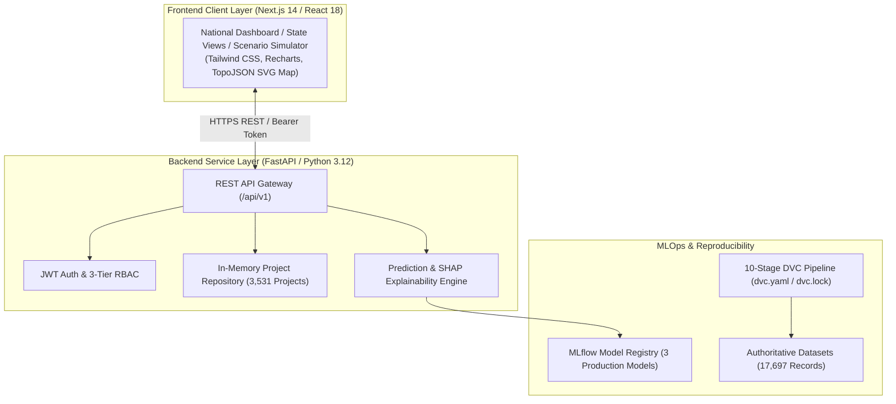

# MoSPI PAIMANA: AI-Powered Infrastructure Project Monitoring & Early-Warning Platform

**Smart India Hackathon 2026**  
**Problem Statement ID:** SIH26103  
**Problem Statement Title:** Use case on web-based integrated project-monitoring platform  
**Target Ministry:** Ministry of Statistics and Programme Implementation (MoSPI), Government of India  
**Platform Nomenclature:** MoSPI PAIMANA (*Predictive Analytics and Integrated Monitoring for Automated National Alerts*) / Nirman-Drishti  

---

## Executive Summary

Under the administrative mandate of MoSPI's Infrastructure and Project Monitoring Division (IPMD), central sector mega-infrastructure projects costing ₹150 Crore and above are monitored across India. While conventional monthly flash reporting records milestones retrospectively, historical records reveal that **over 72% of projects experience schedule delays**, often averaging more than 30 months before completion.

**MoSPI PAIMANA** transforms infrastructure governance from **descriptive and reactive reporting** to **predictive and proactive intervention**. By processing longitudinal monitoring records across 3,531 central infrastructure projects, PAIMANA applies anti-leakage temporal feature engineering and calibrated machine learning models to detect schedule slippage and cost overrun risks **3 to 6 months before formal deadline expiration**.

The platform is delivered as a containerized, full-stack enterprise application featuring a **Next.js 14 frontend** with interactive SVG/TopoJSON choropleth maps, a **FastAPI backend** (Python 3.12) with Role-Based Access Control, a 10-stage **DVC data pipeline**, **MLflow experiment tracking**, and automated **GitHub Actions CI/CD validation**.

---

## Key Features

1. **Dual-Target Predictive Analytics:**
   * **Schedule Delay Classification:** Predicts probability of timeline slippage past sanctioned commissioning dates (**Test F1: 0.9837**, **ROC-AUC: 0.9845**).
   * **Cost Overrun Classification:** Predicts probability of budget escalation over initial sanctions (**Test F1: 0.9606**, **PR-AUC: 0.9683**).
2. **Project Anomaly Sentinel:** Unsupervised `IsolationForest` model identifying irregular reporting dynamics without biased fraud labeling.
3. **Transparent Explainable AI (SHAP):** Real-time TreeSHAP / LinearSHAP attributions isolating the exact drivers (e.g. Schedule-Progress Gap, Capital Burn Velocity) for every individual project.
4. **Interactive National Executive Dashboard:** TopoJSON SVG India choropleth map with state-level drilldowns, sector distribution charts, and automated early-warning alerts.
5. **Scenario Simulation & What-If Planning:** Allows project directors and PMC engineers to simulate physical progress and expenditure adjustments to forecast risk score changes in real time.
6. **Multi-Tier Role-Based Access Control (RBAC):** Scoped access for National Administrators (`ADMIN`), Ministry Heads (`MINISTRY_PROJECT_HEAD`), and CPSE Contractors (`AGENCY_CONTRACTOR`).

---

## High-Level System Architecture



---

## Technology Stack

| Layer | Technologies |
| :--- | :--- |
| **Frontend** | Next.js 14 (App Router), React 18, TypeScript, Tailwind CSS, Recharts, Lucide Icons, TopoJSON |
| **Backend** | FastAPI, Python 3.12, Uvicorn (ASGI), Pydantic v2, PyJWT, Passlib, HTTPX |
| **Machine Learning** | Scikit-learn, XGBoost, LightGBM, SHAP (TreeSHAP / LinearSHAP) |
| **MLOps & Pipeline** | DVC (Data Version Control), MLflow (Registry & Tracking), SQLite |
| **DevOps & Containers**| Docker, Docker Compose, GitHub Actions CI/CD (Ubuntu Latest, Node 20, Python 3.12) |
| **Testing** | Pytest (80 automated tests), TypeScript (`tsc --noEmit`), ESLint |

---

## Repository Structure

```text
├── .github/
│   └── workflows/
│       └── ci.yml                     # 3-stage automated CI pipeline (Pytest, Frontend, Docker smoke)
├── backend/                           # Production FastAPI backend application
│   ├── app/
│   │   ├── api/v1/endpoints/          # 9 endpoint groups (auth, projects, predict, risk, states, etc.)
│   │   ├── core/                      # Configuration, JWT security, and settings
│   │   ├── repositories/              # Project and monthly observation in-memory index
│   │   ├── schemas/                   # Pydantic v2 request/response validation models
│   │   └── services/                  # Business logic, ML inference, and alert services
│   ├── Dockerfile                     # Production multi-stage Python 3.12-slim container
│   └── requirements.txt               # Pinned backend dependencies
├── frontend/                          # Production Next.js 14 web dashboard
│   ├── app/                           # 18 App Router pages (admin, ministry, agency, projects, etc.)
│   ├── components/                    # Reusable UI cards, charts, and interactive India map
│   ├── data/                          # Master JSON records and sector definitions
│   ├── services/                      # Typed API client connecting to backend /api/v1
│   ├── store/                         # Zustand auth and global state management
│   ├── Dockerfile                     # Production multi-stage Node 20-alpine container
│   └── package.json                   # Next.js 14.2.35 dependencies
├── configs/
│   └── model_params.yaml              # Hyperparameters for ML models
├── data/
│   ├── raw/paimana_time_overrun.csv   # Authoritative raw dataset (17,697 rows, 38 columns)
│   ├── processed/                     # Cleaned, validated, and normalized datasets
│   └── features/                      # CUF baseline (10 features) & Enhanced (48 features)
├── models/                            # Production serialized model artifacts (.pkl)
├── reports/                           # Technical analysis reports, dictionaries, and EDA figures
├── src/
│   ├── data/                          # DVC stages (ingest, validate, eda, preprocess, feature_engineering)
│   ├── ml/                            # ML training, evaluation, model selection, anomaly detection
│   └── mlops/                         # MLflow model registration scripts
├── tests/                             # 80 automated unit, schema, and API tests
│   ├── backend/                       # API endpoint, auth, and RBAC tests
│   ├── data/                          # Schema invariants, bounds, and quality tests
│   └── ml/                            # Anti-leakage, determinism, and risk score monotonicity tests
├── docker-compose.yml                 # Multi-container orchestration stack
├── dvc.yaml & dvc.lock                # 10-stage reproducible DVC pipeline definition
└── docs/sih-2026/                     # Complete SIH 2026 judge-ready documentation suite
```

---

## Quickstart: Running the Application Locally

### Option A: Running via Docker Compose (Recommended)
This launches the complete multi-container stack with both frontend and backend configured:

```bash
# 1. Clone repository
git clone https://github.com/shaiksuhail-824/AI-Powered-Predictive-Analytics-Early-Warning-System-for-Infrastructure-Projects.git
cd AI-Powered-Predictive-Analytics-Early-Warning-System-for-Infrastructure-Projects

# 2. Setup environment variables template
cp .env.example .env

# 3. Build and launch containers in detached mode
docker compose up --build -d

# 4. Access live application services:
# - Frontend Web Dashboard:     http://localhost:3000
# - Backend API Gateway:        http://localhost:8000
# - Interactive API Docs:       http://localhost:8000/api/v1/docs
# - Health Verification:        http://localhost:8000/api/v1/health
```

### Pre-configured Demo Sign-In Credentials
* **National Administrator (`ADMIN`):** Username `admin01` | Password `password123`
* **Ministry Official (`MINISTRY_PROJECT_HEAD`):** Username `ministry01` | Password `password123`
* **CPSE Contractor (`AGENCY_CONTRACTOR`):** Username `agency01` | Password `password123`

---

## Automated Testing & CI/CD Pipeline

The repository enforces strict continuous verification. Every pull request executes:
* **Backend Pytest Suite (80 Tests):**
  ```bash
  python -m pytest tests/ -v
  ```
* **Frontend TypeScript Compilation:**
  ```bash
  cd frontend && npx tsc --noEmit
  ```
* **Frontend ESLint:**
  ```bash
  cd frontend && npm run lint
  ```
* **Next.js Production Build:**
  ```bash
  cd frontend && npm run build
  ```
* **Docker Multi-Container Smoke Test:**
  Validated in GitHub Actions on every push to `main` (Run #13) and `dev` (Run #16).

---

## SIH 2026 Complete Documentation Suite

Comprehensive technical, architecture, and judge-defense documents are available in [`docs/sih-2026/`](docs/sih-2026/):

1. [**Project Overview**](docs/sih-2026/01-project-overview.md) — Problem context, objectives, impact, target user personas.
2. [**Problem & Motivation**](docs/sih-2026/02-problem-and-motivation.md) — Mega-project dynamics, flash reporting latency, leading vs lagging indicators.
3. [**System Architecture**](docs/sih-2026/03-system-architecture.md) — 5-layer decoupled architecture with 6 modular Mermaid diagrams.
4. [**Data Architecture & Dictionary**](docs/sih-2026/04-data-architecture.md) — Lineage, canonical models, anti-leakage rules, master field dictionary.
5. [**Machine Learning Methodology**](docs/sih-2026/05-machine-learning-methodology.md) — XGBoost/RF/LogReg models, chronological temporal split, SHAP XAI.
6. [**MLOps & Reproducibility**](docs/sih-2026/06-mlops-and-reproducibility.md) — DVC, MLflow registry, Docker Compose, GitHub Actions automation.
7. [**API Documentation**](docs/sih-2026/07-api-documentation.md) — OpenAPI schemas, query parameters, and example JSON payloads across 9 endpoint groups.
8. [**Frontend User Guide**](docs/sih-2026/08-frontend-user-guide.md) — Complete user journey, route catalog, and screenshot placeholders.
9. [**Testing & Validation Report**](docs/sih-2026/09-testing-and-validation.md) — Pytest scorecard (80 tests pass), type checks, and smoke tests.
10. [**Deployment Guide**](docs/sih-2026/10-deployment-guide.md) — Local Docker deployment and target AWS ECS/ALB cloud architecture.
11. [**Security & Privacy**](docs/sih-2026/11-security-and-privacy.md) — JWT HS256, 3-tier RBAC, Pydantic bounds checking, container hardening.
12. [**Limitations & Future Scope**](docs/sih-2026/12-limitations-and-future-scope.md) — Transparent technical audit and 3-phase national rollout roadmap.
13. [**SIH Presentation & Demo Script**](docs/sih-2026/13-demo-script.md) — 5–7 minute live walkthrough with narration and failover plans.
14. [**Judge FAQ**](docs/sih-2026/14-judge-faq.md) — 15 anticipated technical questions with concise, evidence-based answers.
15. [**Evidence Checklist**](docs/sih-2026/evidence/evidence-checklist.md) — 22-point verification scorecard across all artifacts.

---

## Deployment Status Notice

* **Local Multi-Container Environment:** **VERIFIED & OPERATIONAL** (Docker Compose on ports 8000 and 3000).
* **Target Cloud Deployment (AWS):** **PLANNED PRODUCTION ARCHITECTURE** (Documented with Amazon ECS Fargate, ALB, Route 53, and ECR). Cloud infrastructure is planned and not yet provisioned.

---

## Team Contributions

* **Smart India Hackathon 2026 Team:** SIH26103 Development Team
* **Primary Contacts / Team Members:**
  * To be completed by the team prior to final submission.
