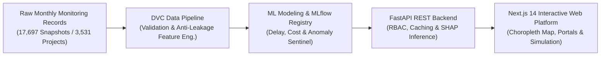

# MoSPI PAIMANA: AI-Powered Predictive Analytics & Early-Warning System for Infrastructure Projects

**Smart India Hackathon 2026**  
**Problem Statement ID:** SIH26103  
**Problem Statement Title:** Use case on web-based integrated project-monitoring platform  
**Target Ministry / Organization:** Ministry of Statistics and Programme Implementation (MoSPI), Government of India  
**Platform Nomenclature:** PAIMANA (*Predictive Analytics and Integrated Monitoring for Automated National Alerts*) / Nirman-Drishti  

---

## 1. Executive Summary

Major central infrastructure projects across India—spanning railways, roads and highways, power, petroleum, and urban development—form the backbone of the nation's economic progress. However, large-scale capital projects routinely suffer from time overruns (schedule delays) and cost escalations. Historically, administrative monitoring has relied upon monthly flash reports and retrospective status reviews. While retrospective reporting tracks historical milestones, it lacks forward-looking predictive foresight: critical bottlenecks are often identified only after significant calendar slippage or budgetary escalation has already occurred.

**MoSPI PAIMANA** is an enterprise-grade, full-stack, AI-powered predictive analytics and early-warning intelligence platform developed for SIH26103. The system ingests longitudinal project monitoring data, applies temporal feature engineering, and utilizes machine learning classifiers (Logistic Regression, Random Forest, and XGBoost) along with an Unsupervised Anomaly Sentinel (`IsolationForest`) to predict:
1. **Schedule Delay Probability ($P(\text{Delay})$)**
2. **Cost Overrun Probability ($P(\text{Cost Overrun})$)**
3. **Composite Multi-Dimensional Project Risk Score ($0 - 100$)**
4. **Attributional Root Causes using Explainable AI (SHAP)**

The platform integrates a high-performance **FastAPI backend** (Python 3.12) with a responsive **Next.js 14 frontend** (Node.js 20, TypeScript, Tailwind CSS), orchestrated through containerized **Docker Compose** architectures, tracked end-to-end with **DVC** and **MLflow**, and validated automatically via **GitHub Actions CI/CD pipelines**.

---

## 2. Problem Background & Context

Under the administrative purview of MoSPI's Infrastructure and Project Monitoring Division (IPMD), central sector projects costing ₹150 Crore and above are monitored on a monthly cadence. Analysis of historical records reveals persistent challenges:

* **Pervasive Delays:** In the baseline operational dataset of 17,697 monthly monitoring records spanning 3,531 central infrastructure projects, **72.61% (12,849 records)** exhibited active schedule slippage, with a median recorded delay of 21.0 months (mean 30.1 months).
* **Information Lag:** Project monitoring has historically been reactive. Decision-makers assess project health based on lagging financial and physical progress indicators rather than leading risk signals.
* **Unobserved Early Indicators:** Discrepancies between physical progress velocity and financial expenditure burn rates frequently precede public announcements of project delays by 3 to 6 months. Manual spreadsheet audits fail to capture these non-linear temporal dynamics.

---

## 3. The Proposed Solution

MoSPI PAIMANA transforms traditional retrospective monitoring into proactive, predictive governance. The solution encompasses:

1. **Automated MLOps Pipeline:** A 10-stage reproducible DVC pipeline executing schema validation, exploratory analysis, anti-leakage feature engineering, model training, evaluation, and registry cataloging.
2. **Multi-Model Predictive Engine:**
   * **Schedule Delay Predictor:** Pipelined classifier achieving **0.9837 Test F1** and **0.9845 Test ROC-AUC**.
   * **Cost Overrun Predictor:** Pipelined ensemble model addressing severe class imbalance with **0.9606 Test F1** and **0.9683 Test PR-AUC**.
   * **Project Anomaly Sentinel:** Unsupervised isolation model identifying abnormal reporting patterns without biased labeling.
   * **Explainable AI (SHAP):** Transparent feature attribution pinpointing exact drivers (e.g., expenditure slippage gap, delayed milestone approvals) for every individual project.
3. **Role-Based Web Dashboard:**
   * **National Executive Overview:** High-level summary metrics, interactive TopoJSON SVG India choropleth map, sector distributions, and automated early-warning alerts.
   * **Ministry & CPSE Portals:** Granular drilldowns filtered by jurisdiction, agency, and risk tier.
   * **Interactive Scenario Simulator:** Allows project directors to simulate adjustments in timeline, budget, or physical progress to observe immediate risk score shifts before submitting reports.

---

## 4. Target User Personas

| Persona | Role in Ecosystem | Primary System Use Cases |
| :--- | :--- | :--- |
| **National Leadership / MoSPI IPMD** | Overall Portfolio Oversight (`ADMIN`) | Macro-level national risk index, inter-state benchmarking, systemic bottleneck identification, high-level early-warning escalation. |
| **Ministry Project Heads** | Sectoral Monitoring (`MINISTRY_PROJECT_HEAD`) | Cross-CPSE oversight within specific ministries (e.g., Railways, MoRTH, Power), resource allocation, milestone review. |
| **CPSE Project Directors & PMC Engineers** | Operational Execution (`AGENCY_CONTRACTOR`) | Project-specific root-cause diagnosis, monthly update reporting, simulation of corrective interventions before milestone submission. |
| **Citizens & Independent Researchers** | Public Transparency (`PUBLIC`) | Public project search, sanctioned cost tracking, macro progress monitoring without access to internal administrative workflows. |

---

## 5. Main Objectives

1. **Eliminate Surprise Delays:** Detect project distress 3 to 6 months before formal schedule extension requests are submitted.
2. **Transparent Explainability:** Ensure no ML prediction acts as a "black box" by computing standardized SHAP attribution scores for every forecast.
3. **Ensure High Reproducibility:** Guarantee 100% deterministic reproducibility across datasets, ML features, and software environments using DVC, MLflow, and Docker.
4. **Zero-Trust Security & RBAC:** Enforce strict role-based access control, JWT authentication, and automated schema validation across all public and internal interfaces.

---

## 6. Key Differentiators

* **Strict Temporal Anti-Leakage Enforcement:** Unlike generic academic models that suffer from data leakage by utilizing future target attributes, PAIMANA enforces strict historical temporal cutoffs ($t \le T_{\text{report}}$) across all 48 engineered features.
* **Domain-Specific Metric Formulations:** Implements standard MoSPI IPMD indices including *Schedule-Progress Gap*, *Expenditure Burn Velocity*, and *Cost-to-Progress Non-Linearity*.
* **Audited Multi-Container Stack:** Fully automated CI/CD pipeline verifying backend pytest suites (80 tests), frontend compilation, and multi-container Docker smoke testing on every git push.

---

## 7. Scope of the SIH Prototype

### Implemented in Current Prototype
* ✅ End-to-end data pipeline processing 17,697 real monthly observation records and 3,531 central infrastructure projects.
* ✅ Trained and serialized production ML models for Schedule Delay, Cost Overrun, and Anomaly Detection with MLflow tracking.
* ✅ Full FastAPI backend with 9 versioned endpoint groups, JWT authentication, and 3-tier RBAC.
* ✅ Next.js 14 web frontend with interactive India map, dynamic state views, project detail pages, and scenario simulation.
* ✅ Multi-container Docker Compose orchestration and automated GitHub Actions CI pipeline.

### Planned for Production Pilot (Future Scope)
* ⏳ Direct integration with live OCMS (Online Computerized Monitoring System) databases via government intranet.
* ⏳ Optical Character Recognition (OCR) and NLP parsing of scanned physical contractor inspection notes and DPR documents.
* ⏳ Production cloud hosting on AWS (ECS Fargate, ALB, CloudWatch, Secrets Manager).
