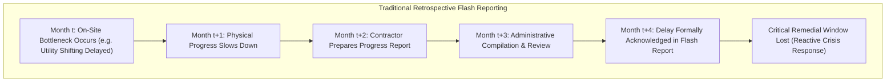

# Problem Statement & Motivation — MoSPI PAIMANA

**Smart India Hackathon 2026 | Problem Statement SIH26103**  
**Domain:** Infrastructure & Project Monitoring Governance  
**Target Ministry:** Ministry of Statistics and Programme Implementation (MoSPI)  

---

## 1. Context & Motivation

Infrastructure development is the primary multiplier of economic growth. Developing expressways, railway freight corridors, port connectivity, power generation plants, and urban transit networks demands massive capital investment. In India, central sector projects costing ₹150 Crore and above are tracked by MoSPI's Infrastructure and Project Monitoring Division (IPMD).

Despite systematic oversight, large capital projects worldwide—and in India specifically—encounter severe cost and time overruns. When a ₹5,000 Crore highway or rail project slips by 24 months, the consequences extend far beyond delayed ribbon-cutting ceremonies:
* **Direct Cost Escalation:** Continued administrative overhead, contractor idling claims, and inflation-driven material price revisions inflate sanctioned budgets.
* **Macroeconomic Opportunity Loss:** Delayed freight corridors suppress trade efficiency, delayed power plants throttle industrial manufacturing, and delayed urban transit increases traffic congestion and environmental emissions.
* **Fiscal Locking:** Public capital tied up in stalled or delayed projects cannot be allocated to new social and economic initiatives.

---

## 2. Core Operational Challenges

### A. The Inherent Complexity of Mega-Projects
Infrastructure projects are non-linear, multi-stakeholder systems spanning multiple years and diverse geographic terrains. Major factors contributing to slippage include:
1. **Right of Way (RoW) & Land Acquisition Delays:** Prolonged negotiation and statutory clearance cycles.
2. **Forest, Wildlife & Environmental Clearances:** Inter-departmental approvals requiring extensive compliance documentation.
3. **Utility Shifting Bottlenecks:** Relocation of high-voltage transmission lines, municipal water mains, and railway crossings.
4. **Law, Order & Localized Geopolitical Disruptions:** Regional protests, geological surprises in tunneling/mining, and extreme monsoon weather.
5. **Contractor Cash-Flow Constraints:** Financial distress among engineering procurement construction (EPC) contractors leading to physical slowdowns.

### B. Limitations of Traditional Retrospective Monitoring
Existing project-monitoring workflows predominantly rely on monthly "Flash Reports" submitted by Central Public Sector Enterprises (CPSEs). While valuable as historical records, these reports suffer from structural limitations:

* **Significant Latency:** From the moment physical velocity slows on site to the time an administrative committee reviews the data, 60 to 90 days routinely elapse.
* **Siloed & Fragmented Records:** Historical project observations are stored across disparate tables and static PDF documents. Longitudinal trends—such as the velocity of progress over the preceding six months—are rarely synthesized into real-time risk scores.
* **Subjective Self-Reporting:** Implementing agencies have natural institutional incentives to report optimistic completion timelines until a delay becomes mathematically unavoidable.
* **Absence of Explainable Predictive Analytics:** Conventional dashboards display tables and bar charts of past expenditures. They do not compute future delay probabilities, nor do they isolate the specific variables driving risk.

---

## 3. The Need for Automated Early Warnings

Proactive infrastructure governance requires moving from *reporting what happened* to *forecasting what will happen unless interventions occur*. 

Early-warning analytics must address three foundational requirements:
1. **Leading vs. Lagging Indicators:** A project's financial expenditure often remains on schedule even as physical milestones slip (due to advance payments or procurement of uninstalled materials). Detecting the *Schedule-Progress Gap* provides an early signal before deadline expiration.
2. **Automated Escalation Triggers:** When a project's risk trajectory accelerates rapidly month-over-month, senior ministry leadership must receive automated alerts categorized by intervention priority (Critical, High, Medium).
3. **Transparent Causal Attribution:** Engineers and administrators will not act on opaque "black box" numbers. The system must explain *why* a project is classified as high-risk (e.g., "72% of risk driven by negative expenditure-progress divergence over the last quarter").

---

## 4. Grounded Separation of Context, Assumptions & Capabilities

To maintain absolute technical integrity for SIH evaluation, the problem space is partitioned into verified official context, team analytical assumptions, and implemented prototype capabilities:

```mermaid
flowchart LR
    subgraph OfficialContext ["1. Official Context (MoSPI IPMD)"]
        OC1["Central sector projects >= ₹150 Cr"]
        OC2["Longitudinal monthly flash reporting"]
        OC3["Recorded historical delay and cost overruns"]
    end

    subgraph TeamAssumptions ["2. Team Analytical Assumptions"]
        TA1["Temporal data at t is sufficient to forecast delay at t+k"]
        TA2["Physical progress velocity correlates with risk trajectory"]
        TA3["Anomalies can be isolated without pejorative fraud labeling"]
    end

    subgraph PrototypeCapabilities ["3. Implemented Prototype Capabilities"]
        PC1["17,697 real project records indexed"]
        PC2["ML models (0.98+ F1 for delay, 0.96+ F1 for cost)"]
        PC3["FastAPI REST backend + Next.js interactive UI"]
    end

    OfficialContext --> TeamAssumptions --> PrototypeCapabilities
```

### 1. Official Problem Context (MoSPI IPMD)
* MoSPI tracks infrastructure projects costing ₹150 Crore and above across India.
* Official records document baseline cost, revised cost, physical progress percentage, cumulative expenditure, original date of commissioning (DOC), anticipated DOC, and recorded delay in months.
* The authoritative historical dataset provided for this problem statement contains **17,697 observation records** across **3,531 central infrastructure projects**.

### 2. Team Analytical Assumptions
* **Temporal Precedence:** Any predictive model must adhere strictly to time $T$. No feature derived from future reporting months ($t > T$) may be utilized, eliminating data leakage.
* **Dynamic Non-Linearity:** The relationship between expenditure and physical completion is non-linear; linear extrapolations systematically under-predict late-stage cost blowouts.
* **Neutral Anomaly Identification:** Operational data irregularities (such as sudden jumps in reported physical progress without corresponding expenditure) should be flagged as statistical anomalies for review, without presumptive fraud terminology.

### 3. Current Prototype Capabilities
* Validated ML models predicting Schedule Delay ($P(\text{Delay})$) and Cost Overrun ($P(\text{Cost Overrun})$) using both standard Common Underlying Feature (CUF) baselines and 48 engineered temporal features.
* Real-time SHAP attribution isolating the top risk drivers for any monitored project.
* Interactive multi-tier dashboards allowing national, ministry, and agency drilldowns with scenario simulation capabilities.
