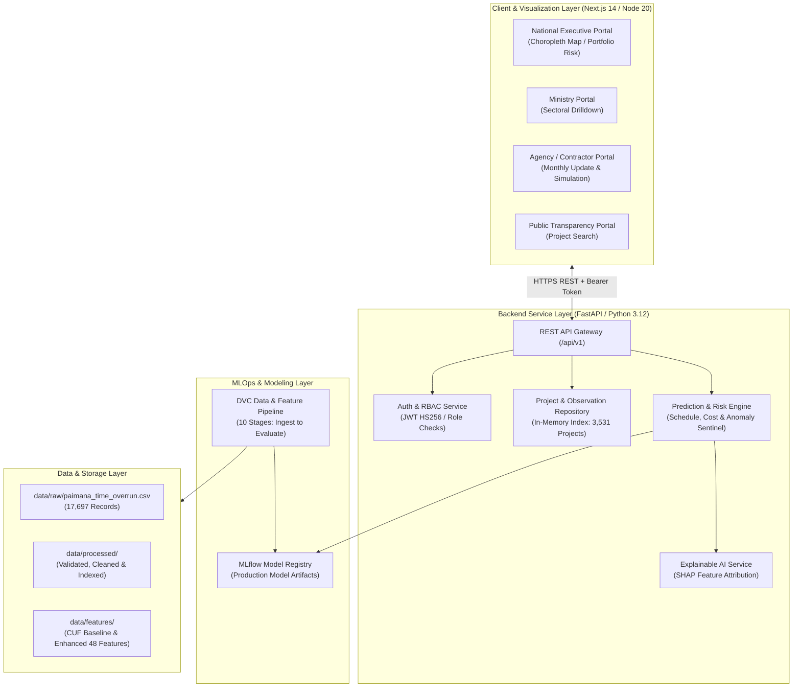
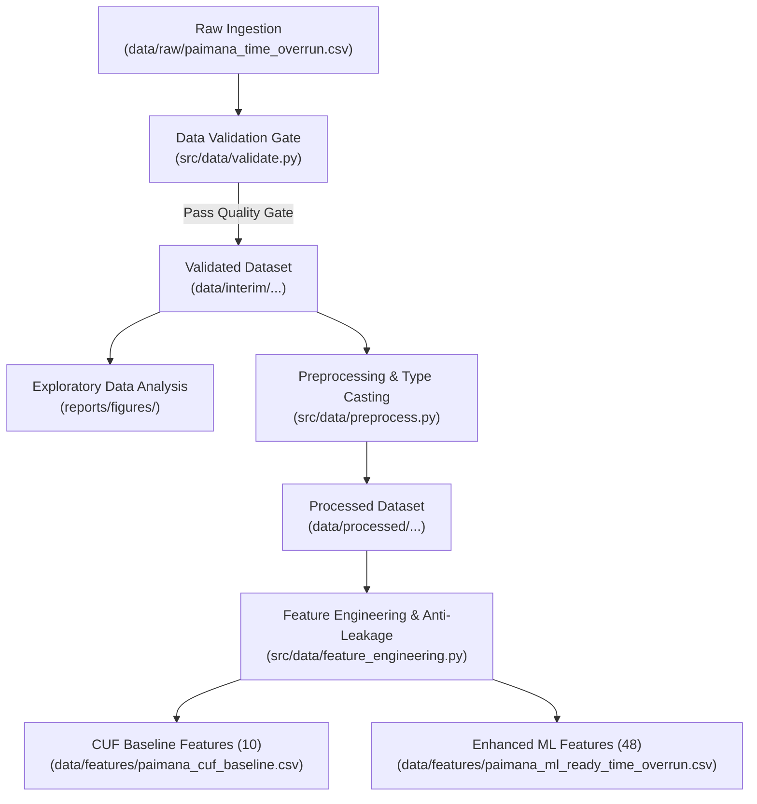
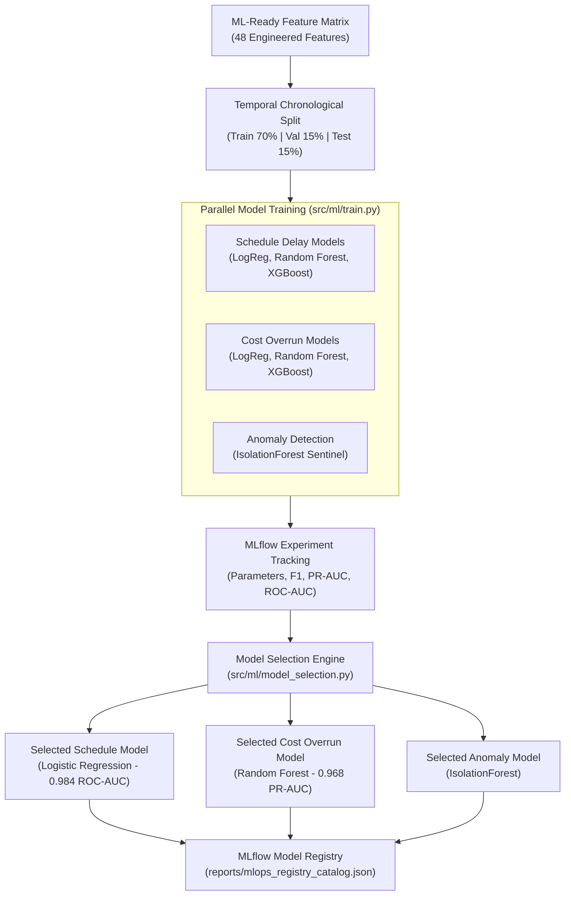
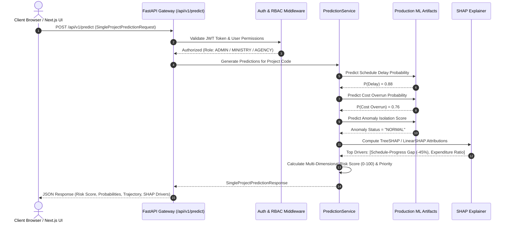
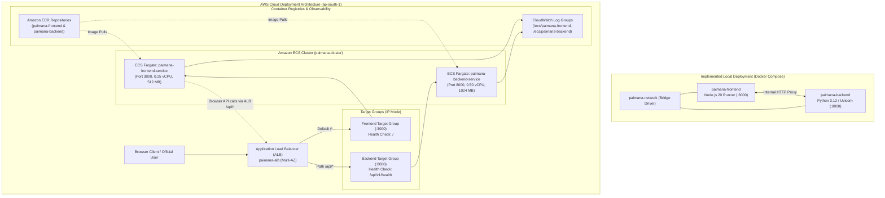
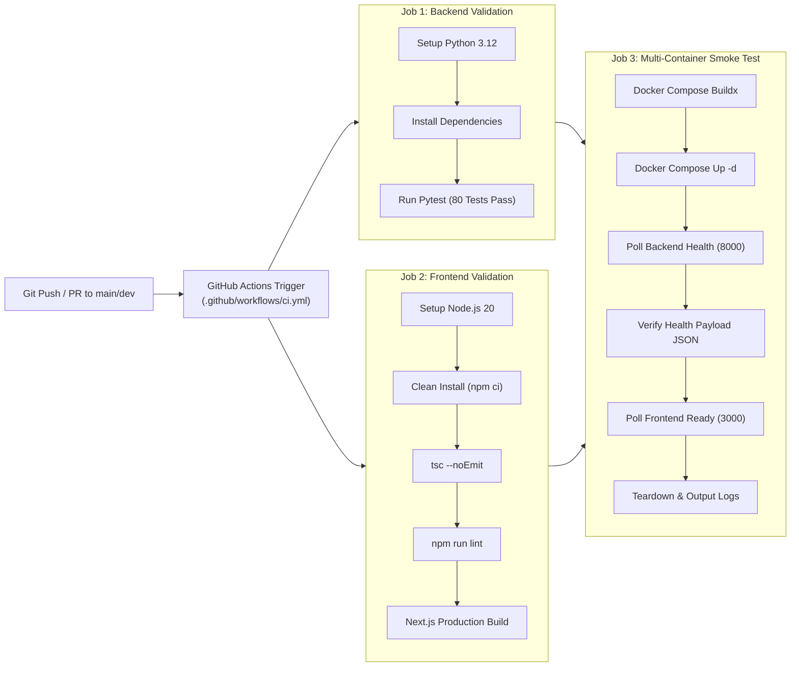

# System Architecture — MoSPI PAIMANA

**Smart India Hackathon 2026 | Problem Statement SIH26103**  
**System Name:** MoSPI PAIMANA (*Predictive Analytics and Integrated Monitoring for Automated National Alerts*)  

---

## 1. High-Level Architecture Overview

MoSPI PAIMANA is designed as an enterprise, containerized, multi-layer analytics platform that bridges raw public infrastructure records with real-time operational governance. The architecture is decoupled into five distinct functional layers:

1. **Data Foundation & Versioning Layer (DVC & Git):** Manages raw data ingestion, parameter-driven cleaning, schema integrity gates, and anti-leakage feature generation.
2. **Machine Learning & Experiment Tracking Layer (Scikit-Learn, XGBoost, MLflow):** Manages model training, hyperparameter optimization, model registry stage management, and SHAP explainability.
3. **Backend Service & API Gateway Layer (FastAPI, Python 3.12, Uvicorn):** Serves cached in-memory project repositories, executes real-time inference, and enforces JWT role-based access control.
4. **Frontend User Experience Layer (Next.js 14, React 18, TypeScript, Tailwind CSS):** Delivers responsive, high-fidelity national, ministry, and project dashboards with TopoJSON choropleth maps and interactive simulation.
5. **Continuous Verification & Deployment Layer (Docker, Docker Compose, GitHub Actions):** Ensures containerized reproducibility, automated CI testing, and cloud readiness.

---

## 2. Mermaid Architectural Diagrams

### Diagram 1: High-Level System Architecture

---

### Diagram 2: Data-Processing Pipeline (DVC Stages)

---

### Diagram 3: Machine Learning Training & Evaluation Pipeline

---

### Diagram 4: Online Prediction & Risk Scoring Flow

---

### Diagram 5: Deployment Architecture (Local vs. AWS ECS + ALB)

---

### Diagram 6: CI/CD Automated Workflow (GitHub Actions)

---

## 3. Component Details & Interactions

### A. Data Ingestion & Canonical Layer
The canonical data layer is anchored by the authoritative dataset [`data/raw/paimana_time_overrun.csv`](file:///c:/Users/varsh/OneDrive/Documents/AI-Powered-Predictive-Analytics-Early-Warning-System-for-Infrastructure-Projects/data/raw/paimana_time_overrun.csv). The dataset contains 17,697 monthly observations spanning 3,531 central projects.
* **Canonical Fields:** `project_code`, `project_name`, `ministry`, `agency`, `state`, `sector`, `original_cost_cr`, `revised_cost_cr`, `cumulative_expenditure_cr`, `physical_progress_pct`, `time_overrun_days`, `time_overrun_months`, `time_overrun_flag`, `report_year`, `report_month_num`.

### B. Machine Learning Engine & Pipeline
* **Feature Engineering:** Implemented in [`src/data/feature_engineering.py`](file:///c:/Users/varsh/OneDrive/Documents/AI-Powered-Predictive-Analytics-Early-Warning-System-for-Infrastructure-Projects/src/data/feature_engineering.py). Generates two feature sets:
  1. `paimana_cuf_baseline.csv`: 10 core Common Underlying Features for baseline benchmarking.
  2. `paimana_ml_ready_time_overrun.csv`: 48 comprehensive features including temporal progress gaps, expenditure velocity, duration ratios, and normalized geographic weights.
* **Model Artifacts:** Production serialized models stored in `models/`:
  * `models/schedule_delay/production_model.pkl` (Logistic Regression pipeline)
  * `models/cost_overrun/production_model.pkl` (Random Forest ensemble pipeline)
  * `models/anomaly_detector/production_anomaly_detector.pkl` (IsolationForest sentinel)

### C. Backend API Gateway & Caching
Built with FastAPI, using [`backend/app/repositories/project_repository.py`](file:///c:/Users/varsh/OneDrive/Documents/AI-Powered-Predictive-Analytics-Early-Warning-System-for-Infrastructure-Projects/backend/app/repositories/project_repository.py) to index and cache:
* All 3,531 unique projects for sub-millisecond filtering.
* All 17,697 monthly historical time-series observation rows.
* Pre-computed model inference predictions across all active projects.
* Normalized state, sector, and CPSE agency distributions.

### D. Frontend Dashboard Architecture
The frontend in [`frontend/`](file:///c:/Users/varsh/OneDrive/Documents/AI-Powered-Predictive-Analytics-Early-Warning-System-for-Infrastructure-Projects/frontend) is built with Next.js 14 App Router:
* **Server-Side Rendering (SSR):** Next.js routes dynamically pre-render on initial load while hydrating client-side interactive React components.
* **SVG TopoJSON Map:** Interactive India map in [`frontend/components/dashboard/IndiaMapInteractive.tsx`](file:///c:/Users/varsh/OneDrive/Documents/AI-Powered-Predictive-Analytics-Early-Warning-System-for-Infrastructure-Projects/frontend/components/dashboard/IndiaMapInteractive.tsx) rendering state-level risk choropleths based on live metrics.
* **State Management:** Zustand stores manage auth tokens (`authStore.ts`) and global application state (`appStore.ts`).

---

## 4. Deployment Status: Implemented vs. Planned
 
| Layer / Component | Technology | Implementation Status | Verification Evidence |
| :--- | :--- | :--- | :--- |
| **Local Orchestration** | Docker Compose | **COMPLETED & VERIFIED** | Multi-container stack up and healthy on ports 8000 and 3000. |
| **CI/CD Pipeline** | GitHub Actions | **COMPLETED & VERIFIED** | Automated CI workflow passes all backend & frontend checks. |
| **Data Versioning** | DVC (Data Version Control) | **COMPLETED & VERIFIED** | 10-stage DAG locked in `dvc.lock` and `dvc.yaml`. |
| **Experiment Tracking** | MLflow | **COMPLETED & VERIFIED** | Tracked in `mlruns/` and `reports/mlops_registry_catalog.json`. |
| **Amazon ECR & ALB** | AWS ECR, ALB, Target Groups | **COMPLETED & VERIFIED** | ECR repos, ALB, and Target Groups provisioned in `ap-south-1`. |
| **Amazon ECS Services** | ECS Fargate Services | **CONFIGURED BUT NOT VERIFIED** | Task definitions & service automation configured in two-phase pipeline. |
| **Cloud Domain & TLS** | Amazon Route 53, ACM | **PLANNED** | Production SSL domain mapping planned for ministry release. |
