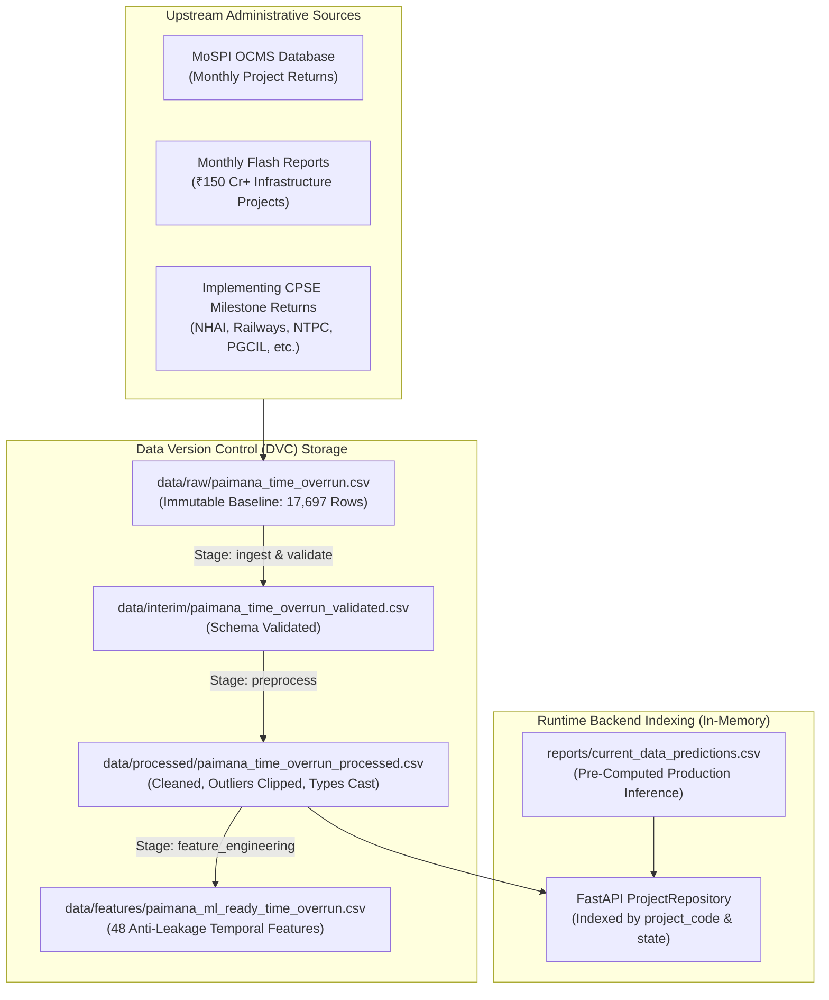

# Data Architecture & Data Dictionary — MoSPI PAIMANA

**Smart India Hackathon 2026 | Problem Statement SIH26103**  
**Dataset Scale:** 17,697 longitudinal monitoring snapshots across 3,531 central infrastructure projects  
**Authoritative Ingestion Path:** `data/raw/paimana_time_overrun.csv`  

---

## 1. Data Sources & Ingestion Lineage

The data architecture for MoSPI PAIMANA processes longitudinal project records originating from MoSPI's Infrastructure and Project Monitoring Division (IPMD) and the Online Computerized Monitoring System (OCMS).



---

## 2. Canonical Data Model

The data layer models infrastructure projects across two primary dimensions:
1. **Canonical Project Dimension:** Static and slowly changing metadata (Project Code, Project Name, Implementing CPSE/Agency, Ministry, Sector, Geographic State/UT, Sanctioned Initial Budget, Approval Date).
2. **Longitudinal Monthly Observation Fact:** Temporal monthly snapshots containing dynamic progress variables (Cumulative Expenditure, Physical Progress Percentage, Elapsed Duration, Slippage Days, Ground-Truth Overrun Flags).

### Composite Primary Key
Every historical observation is uniquely keyed on:
$$\text{Observation Key} = (\texttt{project\_code},\; \texttt{report\_year},\; \texttt{report\_month\_num})$$

Data validation enforces zero duplicate keys across all 17,697 rows (`0 duplicate records detected`).

---

## 3. Data Cleaning, Imputation & Anti-Leakage Rules

### A. Strict Anti-Leakage Protocol
To guarantee real-world predictive validity, feature engineering enforces a strict temporal cutoff:
$$\text{Available Features at time } T = \{ X_t \mid t \le T \}$$
* **Forbidden Fields:** Target variables (`time_overrun_days`, `time_overrun_months`, `time_overrun_flag`, `cost_overrun_flag`, `revised_completion_date`) are strictly isolated from the feature matrix $X$.
* **Forward-Looking Leakage Prevention:** Milestone velocities are computed looking exclusively backward ($t - 1, t - 2, \dots$), never forward.

### B. Missing-Value Handling
* Features with missing values in optional timeline metrics (e.g., `approval_to_start_days`) are imputed with robust medians within their CPSE peer group.
* **Missingness Indicators:** For every imputed feature, a binary companion indicator flag (`*_missing`) is created (0 if observed, 1 if imputed) allowing tree-based and linear models to learn reporting incompleteness patterns.

### C. Outlier Clipping & Boundary Enforcement
Parameters defined in [`params.yaml`](file:///c:/Users/varsh/OneDrive/Documents/AI-Powered-Predictive-Analytics-Early-Warning-System-for-Infrastructure-Projects/params.yaml) govern data sanitization:
* `physical_progress_pct` is bounded strictly within $[0.0\%, 100.0\%]$.
* `sanction_cost` and `cumulative_expenditure` enforce non-negativity ($0 \le \text{cost}$).
* `expenditure_to_original_cost_pct` is capped at $500\%$ to prevent extreme leverage distortion from erroneous decimal entries in legacy returns.

---

## 4. Master Data Dictionary

The following table documents all core canonical and engineered fields derived from [`reports/data_dictionary.md`](file:///c:/Users/varsh/OneDrive/Documents/AI-Powered-Predictive-Analytics-Early-Warning-System-for-Infrastructure-Projects/reports/data_dictionary.md) and [`src/data/feature_engineering.py`](file:///c:/Users/varsh/OneDrive/Documents/AI-Powered-Predictive-Analytics-Early-Warning-System-for-Infrastructure-Projects/src/data/feature_engineering.py):

| Field Name | Data Type | Required / Optional | Description & Derivation | Example Value | Source | Validation Gate Rule |
| :--- | :--- | :--- | :--- | :--- | :--- | :--- |
| `project_code` | `string` | Required | Unique alphanumeric MoSPI project identifier | `060100093` | Master Registry | Alphanumeric string; non-null; unique entity key |
| `report_year` | `integer` | Required | Calendar year of monthly monitoring return | `2025` | Snapshot Metadata | $2000 \le \text{year} \le 2030$ |
| `report_month_num` | `integer` | Required | Calendar month of snapshot ($1 - 12$) | `4` | Snapshot Metadata | $1 \le \text{month} \le 12$ |
| `original_cost_cr` | `float` | Required | Approved initial sanctioned capital cost in INR Crores | `11816.40` | CCEA / Cabinet Sanction | Must be positive ($\text{cost} > 0.0$) |
| `revised_cost_cr` | `float` | Optional | Revised sanctioned cost if administrative RCE approved | `14250.00` | Administrative Order | If present, $\text{revised} \ge 0.0$ |
| `cumulative_expenditure_cr` | `float` | Required | Total capital spend incurred through reporting month | `6584.29` | CPSE Utilization Return | Must be non-negative ($\text{expenditure} \ge 0.0$) |
| `physical_progress_pct` | `float` | Required | Certified cumulative physical completion percentage | `77.20` | PMC Inspection Record | $0.0 \le \text{progress} \le 100.0$ |
| `planned_duration_days` | `float` | Required | Planned duration from physical start to original DOC | `912.0` | Approved Master Schedule | Must be strictly positive ($\text{days} > 0$) |
| `elapsed_duration_days` | `float` | Required | Calendar days elapsed from start to reporting date | `1218.0` | Snapshot Timestamp Diff | Non-negative ($\text{elapsed} \ge 0$) |
| `elapsed_duration_pct` | `float` | Required | Lifecycle consumed: $(\text{elapsed} / \text{planned}) \times 100$ | `111.75` | Derived Ratio | Values $> 100\%$ indicate overdue schedule |
| `schedule_progress_gap_pct` | `float` | Required | Lead/Lag: $\text{physical\_progress} - \text{elapsed\_duration\_pct}$ | `-34.55` | Derived Core Metric | Negative indicates physical lagging elapsed time |
| `expenditure_to_original_cost_pct`| `float` | Required | Budget burn: $(\text{cumulative\_exp} / \text{original\_cost}) \times 100$| `55.72` | Derived Financial Metric | Values $> 100\%$ flag cost overrun |
| `expenditure_per_progress_pct_cr` | `float` | Required | Capital spend per $1\%$ progress unit (INR Cr / %) | `85.28` | Derived Burn Metric | Positive float; identifies burn anomalies |
| `remaining_original_cost_cr` | `float` | Required | Unspent sanctioned budget: $\text{original} - \text{expenditure}$ | `5232.11` | Derived Balance | Signed float |
| `approval_to_start_days` | `float` | Optional | Lag days between sanction approval and work start | `304.0` | Milestone Diff | Non-negative; imputed if unrecorded |
| `agency_frequency` | `float` | Required | Frequency weight of implementing CPSE across portfolio | `0.052` | Master Distribution | $0.0 \le \text{freq} \le 1.0$ |
| `state_frequency` | `float` | Required | Frequency weight of project state jurisdiction | `0.038` | Master Distribution | $0.0 \le \text{freq} \le 1.0$ |
| `time_overrun_days` | `float` | Target (Hidden from X)| Ground-truth schedule slippage in calendar days | `1096.0` | Official Determination | Segregated target column; non-negative |
| `time_overrun_months` | `float` | Target (Hidden from X)| Schedule slippage in months ($\text{days} / 30.4375$) | `36.01` | Official Determination | Segregated target column; non-negative |
| `time_overrun_flag` | `integer` | Target (Hidden from X)| Binary overrun label ($1 = \text{delayed}, 0 = \text{on time}$) | `1` | Official Determination | Binary $\in \{0, 1\}$ |

---

## 5. DVC Data Versioning Configuration

Data assets are version-controlled using **DVC** (`.dvc/` and `dvc.yaml`).

```yaml
# Ingestion & Validation stages from dvc.yaml
stages:
  ingest:
    cmd: python src/data/ingest.py
    deps:
      - src/data/ingest.py
    outs:
      - data/raw/paimana_time_overrun.csv
      - reports/source_metadata.md

  validate:
    cmd: python src/data/validate.py
    deps:
      - data/raw/paimana_time_overrun.csv
      - src/data/validate.py
    outs:
      - data/interim/paimana_time_overrun_validated.csv
      - reports/data_quality.md
```

### Reproducibility Guarantee
Running `dvc repro` deterministically recalculates SHA256 checksums, validates data invariants, and locks intermediate artifacts in [`dvc.lock`](file:///c:/Users/varsh/OneDrive/Documents/AI-Powered-Predictive-Analytics-Early-Warning-System-for-Infrastructure-Projects/dvc.lock).
