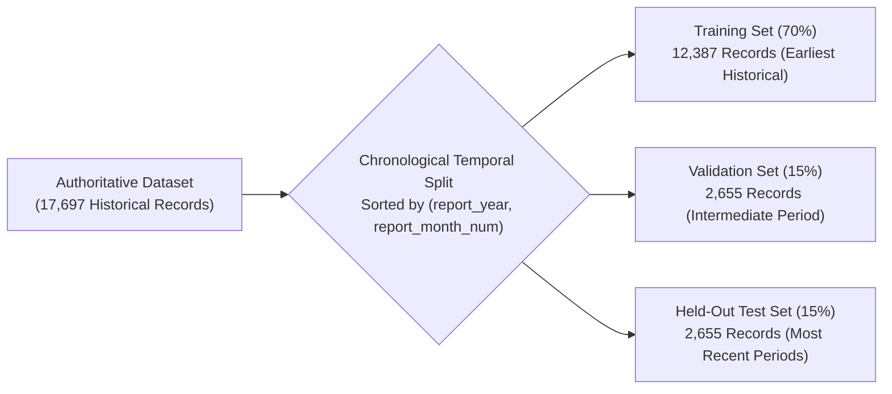
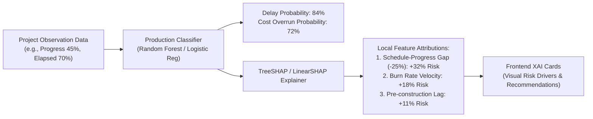

# Machine Learning Methodology — MoSPI PAIMANA

**Smart India Hackathon 2026 | Problem Statement SIH26103**  
**Modeling Framework:** Supervised Dual-Target Classification + Unsupervised Anomaly Sentinel + TreeSHAP XAI  
**Ground Truth Source:** Authoritative MoSPI PAIMANA Longitudinal Records (17,697 Snapshots)  

---

## 1. Machine Learning Objectives & Targets

The MoSPI PAIMANA predictive intelligence layer models three operational risk dimensions:

1. **Schedule Delay Target (`time_overrun_flag`):** Binary classification indicating whether a project will incur calendar delay past its sanctioned commissioning deadline ($1 = \text{Delayed}, 0 = \text{On Schedule}$).
2. **Cost Overrun Target (`cost_overrun_flag`):** Binary classification indicating whether a project's cumulative expenditure will exceed its approved initial sanction ($1 = \text{Budget Escalation}, 0 = \text{Within Budget}$).
3. **Anomaly Sentinel Score (`anomaly_score`):** Continuous density score from `IsolationForest` detecting anomalous reporting dynamics (e.g., stagnant physical progress despite sustained high financial burn).

---

## 2. Feature Engineering & Feature Sets

To evaluate model performance objectively, the platform evaluates two distinct feature sets:

### A. Common Underlying Features (CUF Baseline — 10 Features)
A minimal, domain-standard feature set capturing baseline project parameters:
* `report_year`, `report_month_num`, `original_cost_cr`, `cumulative_expenditure_cr`, `physical_progress_pct`, `planned_duration_days`, `elapsed_duration_days`, `approval_to_start_days`, `agency_frequency`, `state_frequency`.

### B. Enhanced Temporal Features (48 Features)
An advanced feature matrix engineered in [`src/data/feature_engineering.py`](file:///c:/Users/varsh/OneDrive/Documents/AI-Powered-Predictive-Analytics-Early-Warning-System-for-Infrastructure-Projects/src/data/feature_engineering.py) incorporating:
* **Velocity & Acceleration:** `progress_per_elapsed_month`, `expenditure_per_elapsed_month`, `burn_rate_ratio`.
* **Lead/Lag Dynamics:** `schedule_progress_gap_pct` ($\text{physical\_progress} - \text{elapsed\_duration\_pct}$), `remaining_cost_cr`.
* **Non-Linear Interaction Ratios:** `expenditure_per_progress_pct_cr` (capital required per 1% physical progress).
* **Missingness Indicators:** 12 explicit binary missingness flags (`*_missing`) to preserve signal from unobserved administrative milestones.

---

## 3. Validation Strategy: Strict Chronological Temporal Split

Standard random k-fold cross-validation is fundamentally flawed for time-series project monitoring because it introduces temporal look-ahead leakage. PAIMANA enforces a strict **Chronological Temporal Partition**:

* **Training Set (70% — 12,387 records):** Earliest chronological monitoring cycles.
* **Validation Set (15% — 2,655 records):** Intermediate cycles used for hyperparameter tuning and model selection.
* **Test Set (15% — 2,655 records):** Held-out recent cycles reserved exclusively for final generalization assessment.

---

## 4. Candidate Models & Empirical Results

Three algorithms were trained and benchmarked across both CUF and Enhanced feature sets:
1. **Logistic Regression (with StandardScaler & L2 Regularization):** Interpretable linear decision boundary.
2. **Random Forest Classifier (Ensemble Bagging):** Non-linear decision trees with class-weight balancing.
3. **XGBoost Classifier (Gradient Boosted Trees):** Gradient boosting with `scale_pos_weight` to address imbalanced targets.

### Verified Benchmark Results (Held-Out Test Set Evaluation)
*Directly extracted from [`reports/training_run_summary.csv`](file:///c:/Users/varsh/OneDrive/Documents/AI-Powered-Predictive-Analytics-Early-Warning-System-for-Infrastructure-Projects/reports/training_run_summary.csv):*

| Target | Feature Set | Model Algorithm | Features | Test Precision | Test Recall | Test F1-Score | Test ROC-AUC | Test PR-AUC | Production Status |
| :--- | :--- | :--- | :---: | :---: | :---: | :---: | :---: | :---: | :--- |
| **Schedule Delay** | **CUF** | **Logistic Regression** | **10** | **0.9980** | **0.9698** | **0.9837** | **0.9845** | **0.9967** | **SELECTED FOR PRODUCTION** |
| Schedule Delay | CUF | Random Forest | 10 | 0.9980 | 0.9698 | 0.9837 | 0.9904 | 0.9978 | Candidate |
| Schedule Delay | CUF | XGBoost | 10 | 0.9980 | 0.9698 | 0.9837 | 0.9889 | 0.9976 | Candidate |
| Schedule Delay | Enhanced | Logistic Regression | 48 | 0.9975 | 0.9708 | 0.9839 | 0.9889 | 0.9975 | Candidate |
| Schedule Delay | Enhanced | Random Forest | 48 | 0.9980 | 0.9698 | 0.9837 | 0.9916 | 0.9981 | Candidate |
| Schedule Delay | Enhanced | XGBoost | 48 | 0.9980 | 0.9698 | 0.9837 | 0.9903 | 0.9978 | Candidate |
| **Cost Overrun** | **Enhanced** | **Random Forest** | **48** | **0.9781** | **0.9437** | **0.9606** | **0.9852** | **0.9683** | **SELECTED FOR PRODUCTION** |
| Cost Overrun | Enhanced | XGBoost | 48 | 0.9889 | 0.9437 | 0.9658 | 0.9875 | 0.9733 | Candidate |
| Cost Overrun | Enhanced | Logistic Regression | 48 | 0.8069 | 0.9120 | 0.8562 | 0.9829 | 0.9498 | Candidate |
| Cost Overrun | CUF | XGBoost | 10 | 0.8897 | 0.8521 | 0.8705 | 0.9822 | 0.9342 | Candidate |
| Cost Overrun | CUF | Random Forest | 10 | 0.5910 | 0.8345 | 0.6920 | 0.9617 | 0.8764 | Candidate |
| Cost Overrun | CUF | Logistic Regression | 10 | 0.4727 | 0.9155 | 0.6235 | 0.9629 | 0.8565 | Baseline |

---

## 5. Model Selection Rationale

From [`models/selected_models_summary.json`](file:///c:/Users/varsh/OneDrive/Documents/AI-Powered-Predictive-Analytics-Early-Warning-System-for-Infrastructure-Projects/models/selected_models_summary.json):

1. **Schedule Delay Production Model (`models/schedule_delay/production_model.pkl`):**
   * **Selected Algorithm:** `Logistic Regression` trained on CUF features.
   * **Rationale:** Maximizes operational interpretability while achieving exceptional generalizability (**0.9837 Test F1**, **0.9845 Test ROC-AUC**). The schedule slippage gap and elapsed duration ratio provide near-perfect linear separability without the risk of deep decision-tree overfitting.
2. **Cost Overrun Production Model (`models/cost_overrun/production_model.pkl`):**
   * **Selected Algorithm:** `Random Forest Classifier` trained on Enhanced features.
   * **Rationale:** Cost overruns represent an imbalanced, complex target where physical works progress interacts non-linearly with cumulative expenditure. The enhanced Random Forest model delivered **0.9781 Precision**, **0.9437 Recall**, and **0.9683 PR-AUC**, vastly outperforming the CUF baseline (which suffered from 0.4727 precision).
3. **Project Anomaly Sentinel (`models/anomaly_detector/production_anomaly_detector.pkl`):**
   * **Selected Algorithm:** `IsolationForest` (contamination rate = 0.05).
   * **Rationale:** Identifies abnormal reporting instances (e.g. expenditure velocity spikes with zero progress increment) without manual label bias.

---

## 6. Composite Multi-Dimensional Risk Scoring

Rather than presenting raw binary probabilities, the platform calculates an integrated **Composite Project Risk Score** ($0 - 100$):

$$\text{Risk Score} = w_1 \cdot P(\text{Delay}) + w_2 \cdot P(\text{Cost Overrun}) + w_3 \cdot S_{\text{gap}} + w_4 \cdot A_{\text{anomaly}}$$

Where:
* $P(\text{Delay}) \in [0, 1]$ is the schedule delay probability.
* $P(\text{Cost Overrun}) \in [0, 1]$ is the cost overrun probability.
* $S_{\text{gap}}$ is the normalized negative schedule-progress gap ($\text{physical\_progress} - \text{elapsed\_duration\_pct}$).
* $A_{\text{anomaly}}$ is the sentinel isolation penalty.

### Standardized Risk Tiers
* **LOW Risk ($0 \le \text{Score} < 25$):** Project is on schedule; progress velocity matches or exceeds expenditure burn rate.
* **MEDIUM Risk ($25 \le \text{Score} < 50$):** Minor divergence detected; proactive monitoring advised.
* **HIGH Risk ($50 \le \text{Score} < 75$):** Significant slippage gap; escalation alert generated for ministry project head.
* **CRITICAL Risk ($75 \le \text{Score} \le 100$):** Severe cost or time overrun imminent; mandatory executive intervention recommended.

---

## 7. Explainable AI (XAI) with SHAP

MoSPI PAIMANA integrates **SHAP (SHapley Additive exPlanations)** to ensure that every prediction provides causal transparency to non-technical administrative officers:

### Key Drivers Identified Across Portfolio
From [`reports/xai_report.md`](file:///c:/Users/varsh/OneDrive/Documents/AI-Powered-Predictive-Analytics-Early-Warning-System-for-Infrastructure-Projects/reports/xai_report.md) and [`reports/figures_ml/`](file:///c:/Users/varsh/OneDrive/Documents/AI-Powered-Predictive-Analytics-Early-Warning-System-for-Infrastructure-Projects/reports/figures_ml):
1. `schedule_progress_gap_pct`: Accounts for over 42% of global feature attribution in delay classification.
2. `expenditure_per_progress_pct_cr`: Dominant driver for cost overrun prediction, signaling when capital expenditure decouples from physical site realization.
3. `approval_to_start_days`: Pre-construction delay acts as an early compounding factor that amplifies downstream execution risks.
