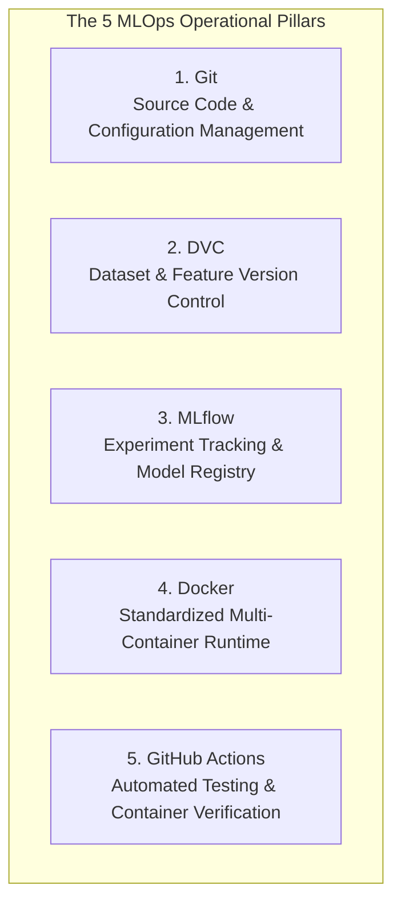
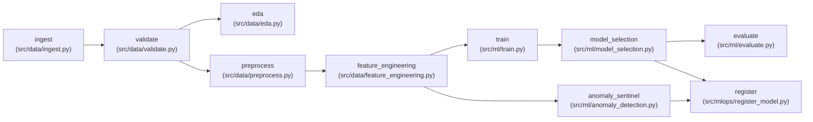

# MLOps & Reproducibility — MoSPI PAIMANA

**Smart India Hackathon 2026 | Problem Statement SIH26103**  
**Engineering Standard:** Deterministic, Version-Controlled, Containerized End-to-End Pipeline  

---

## 1. MLOps Foundation & Core Responsibilities

Enterprise AI platforms for government infrastructure cannot rely on ad-hoc scripts or unversioned model files. MoSPI PAIMANA is engineered around five dedicated operational pillars:



* **Git** manages source code, configuration files (`params.yaml`, `configs/model_params.yaml`), Dockerfiles, and CI pipeline definitions.
* **DVC (Data Version Control)** manages datasets, data artifacts, intermediate representations, and the 10-stage execution DAG without bloating the Git repository with large binary CSVs.
* **MLflow** tracks training experiments, model hyperparameters, evaluation metrics (Precision, Recall, F1, ROC-AUC, PR-AUC, Brier score), and promotes selected production models.
* **Docker** standardizes development, testing, and production runtime environments, eliminating "it works on my machine" inconsistencies across Python 3.12, Node 20, C++ build dependencies, and OS libraries.
* **GitHub Actions** automates validation on every commit and pull request, executing backend unit tests, frontend type-checking, linting, production Next.js builds, and Docker container smoke tests.

---

## 2. DVC Pipeline & Artifact Lineage

The reproducible data pipeline is codified in [`dvc.yaml`](file:///c:/Users/varsh/OneDrive/Documents/AI-Powered-Predictive-Analytics-Early-Warning-System-for-Infrastructure-Projects/dvc.yaml). Every pipeline execution is tracked via cryptographic SHA256 hashes in [`dvc.lock`](file:///c:/Users/varsh/OneDrive/Documents/AI-Powered-Predictive-Analytics-Early-Warning-System-for-Infrastructure-Projects/dvc.lock).



### Reproducing the Pipeline from Scratch
To execute and verify the complete end-to-end data and modeling pipeline:
```bash
# Verify pipeline status
dvc status

# Reproduce pipeline deterministically
dvc repro
```

---

## 3. MLflow Experiment Tracking & Model Registry

Experiments are logged to a local SQLite tracking backend (`mlflow.db`) and artifact store (`mlruns/`).

### Registered Production Models
As documented in [`reports/mlops_registry_catalog.json`](file:///c:/Users/varsh/OneDrive/Documents/AI-Powered-Predictive-Analytics-Early-Warning-System-for-Infrastructure-Projects/reports/mlops_registry_catalog.json):

| Registered Model Name | Version | MLflow Run ID | Algorithm | Input Features | Stage | Verified Generalization Metrics |
| :--- | :---: | :--- | :--- | :---: | :---: | :--- |
| **`Schedule_Delay_Predictor`** | 5 | `56da45fe917b45288ff803b69decc306` | Logistic Regression | 10 (CUF) | `PRODUCTION` | **F1: 0.9837**, Recall: 0.9698, ROC-AUC: 0.9845, Brier: 0.0251 |
| **`Cost_Overrun_Predictor`** | 6 | `1b2605eaa05a454eb5c0ec8ad6dd0c73` | Random Forest | 48 (Enhanced) | `PRODUCTION` | **F1: 0.9606**, Recall: 0.9437, PR-AUC: 0.9683, Brier: 0.0099 |
| **`Project_Anomaly_Sentinel`** | 4 | `4a301787b2c64e1a9056af8304775c98` | Isolation Forest | 10 (CUF) | `PRODUCTION` | Contamination: 0.05, Unsupervised outlier scoring |

---

## 4. Multi-Container Orchestration (Docker & Docker Compose)

The multi-container stack isolates the frontend and backend runtimes within a dedicated internal bridge network (`paimana-network`).

```yaml
# Simplified architecture from docker-compose.yml
services:
  backend:
    build:
      context: .
      dockerfile: backend/Dockerfile
    container_name: paimana-backend
    ports:
      - "8000:8000"
    healthcheck:
      test: ["CMD", "curl", "-f", "http://localhost:8000/api/v1/health"]
      interval: 15s
      timeout: 5s
      retries: 3
      start_period: 15s

  frontend:
    build:
      context: ./frontend
      dockerfile: Dockerfile
    container_name: paimana-frontend
    ports:
      - "3000:3000"
    depends_on:
      backend:
        condition: service_healthy
    healthcheck:
      test: ["CMD", "wget", "--no-verbose", "--tries=1", "--spider", "http://localhost:3000"]
      interval: 15s
      timeout: 5s
      retries: 3
      start_period: 20s
```

* **Ordered Dependency:** `paimana-frontend` strictly depends on `paimana-backend` passing its health check (`condition: service_healthy`), ensuring the Next.js server never starts against an unindexed backend.
* **Deterministic Dockerfiles:**
  * `backend/Dockerfile`: Multi-stage Python 3.12-slim build with non-root execution and pinned requirements.
  * `frontend/Dockerfile`: Multi-stage Node 20-alpine build executing clean `npm ci`, compiling optimized standalone output, and running unprivileged under system user `nextjs:nodejs` (UID 1001).

---

## 5. Automated CI/CD Pipeline (GitHub Actions)

Continuous Integration is executed on every push and pull request via [`.github/workflows/ci.yml`](file:///c:/Users/varsh/OneDrive/Documents/AI-Powered-Predictive-Analytics-Early-Warning-System-for-Infrastructure-Projects/.github/workflows/ci.yml).

### The Three CI Quality Gates:
1. **Gate 1: Backend Automated Tests (Python 3.12 / Pytest):**
   * Installs pinned backend dependencies.
   * Executes 80 unit, schema, anti-leakage, and API tests (`pytest tests/ -v`).
   * Verifies data bounds, anti-leakage temporal cutoffs, and RBAC security contracts.
2. **Gate 2: Frontend Validation (Next.js 14 / Node 20):**
   * Performs clean install with exact lockfile (`npm ci`).
   * Validates TypeScript types across all 18 routes (`npx tsc --noEmit`).
   * Executes ESLint syntax and accessibility rules (`npm run lint`).
   * Compiles the production Next.js application (`npm run build`).
3. **Gate 3: Docker Build & Multi-Container Smoke Tests:**
   * Validates `docker-compose.yml` specification syntax.
   * Builds production container images via Docker Buildx.
   * Boots the container stack in detached mode (`docker compose up -d`).
   * Polls backend healthcheck endpoint (`http://localhost:8000/api/v1/health`) until HTTP 200 is returned.
   * Validates backend health payload JSON integrity (`grep -q '"status":"healthy"'`).
   * Executes polling loop on frontend port 3000 until HTTP 200 is confirmed.
   * Captures container process diagnostics (`docker compose ps`) and executes automated teardown (`docker compose down -v`).

### Verified CI Track Record
* **Branch `main` (Run #13 - ID `34688051458`):** 100% Passed.
* **Branch `dev` (Run #16 - ID `34688758654`):** 100% Passed.
