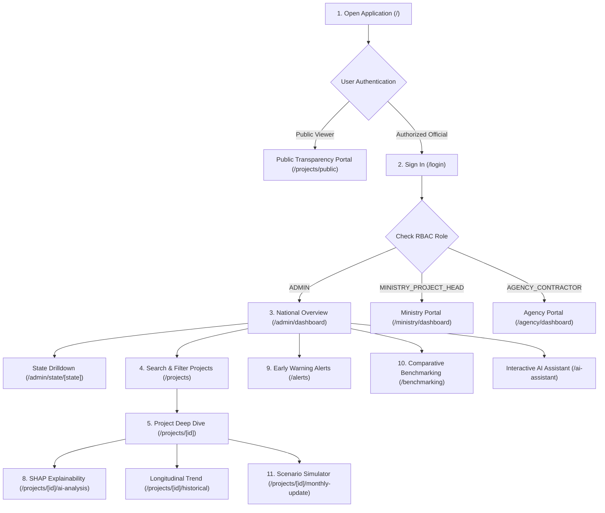

# Frontend User Guide & Workflow — MoSPI PAIMANA

**Smart India Hackathon 2026 | Problem Statement SIH26103**  
**Frontend Stack:** Next.js 14 (App Router), React 18, TypeScript, Tailwind CSS, Recharts, TopoJSON SVG Map  
**Default Access URL:** `http://localhost:3000`  

---

## 1. Complete User Journey

The MoSPI PAIMANA web interface is tailored for multiple governance tiers, providing role-based workflows for National Administrators, Ministry Officials, CPSE Project Directors, and the Public.

---

## 2. Step-by-Step User Workflows

### Step 1: Open Application Landing Page
* **Route:** `/`
* **What to expect:** High-impact hero section showcasing national infrastructure scale, hero slideshow of primary sectors (Highways, Energy, Water, Urban Transit), and quick-action links to login or explore public data.
* *Placeholder:* ``

### Step 2: Role-Based Secure Sign In
* **Route:** `/login`
* **Pre-configured Demo Credentials:**
  * **National Administrator (`ADMIN`):** Username `admin01` | Password `password123`
  * **Ministry Official (`MINISTRY_PROJECT_HEAD`):** Username `ministry01` | Password `password123`
  * **CPSE Contractor (`AGENCY_CONTRACTOR`):** Username `agency01` | Password `password123`
* *Placeholder:* ``

### Step 3: National Executive Dashboard Overview
* **Route:** `/admin/dashboard`
* **Features:**
  * **KPI Metric Cards:** Total projects monitored (3,531), delayed projects, critical-risk count, and average portfolio risk.
  * **Interactive India Choropleth Map:** Color-coded state geometry based on dominant risk tiers. Clicking any state navigates directly to that state's dedicated oversight view (`/admin/state/[state]`).
  * **Portfolio Trajectory:** Line chart showing temporal delay trends vs. physical completion velocities.
* *Placeholder:* ``

### Step 4: Search & Multi-Criteria Project Filtering
* **Route:** `/projects`
* **Features:** Instant client-side search across project codes, titles, states, and CPSE agencies, combined with dropdown filters for risk level (`LOW`, `MEDIUM`, `HIGH`, `CRITICAL`) and delayed status.
* *Placeholder:* ``

### Step 5: Project Operational Deep Dive
* **Route:** `/projects/[id]` or `/admin/project/[id]`
* **Features:**
  * **Financial Escalation Gauge:** Original sanctioned budget vs. revised sanctioned cost vs. actual cumulative expenditure.
  * **Milestone Schedule Tracker:** Original target commissioning date (DOC), revised DOC, and calculated calendar overrun.
  * **Physical vs. Financial Progress Bar:** Visual indicator of whether expenditure burn is outpacing physical ground execution.
* *Placeholder:* ``

### Step 6: AI-Powered Risk Score & SHAP Drivers
* **Route:** `/projects/[id]/ai-analysis`
* **Features:**
  * **Predicted Probabilities:** $P(\text{Schedule Delay})$ and $P(\text{Cost Overrun})$.
  * **Composite Risk Gauge:** Standardized 0–100 score with risk trajectory direction (`RAPID_ESCALATION`, `STABLE`, `IMPROVING`).
  * **TreeSHAP Attribution Cards:** Ranked breakdown of the top causal drivers responsible for the project's risk rating.
* *Placeholder:* ``

### Step 7: Automated Early-Warning Alerts & Escalations
* **Route:** `/alerts`
* **Features:** Real-time alert feed categorizing warnings by severity (Critical, High, Medium), displaying automated root-cause diagnostics and responsible administrative agencies.
* *Placeholder:* ``

### Step 8: Multi-Dimensional Benchmarking
* **Route:** `/benchmarking`
* **Features:** Compares any target project against regional peers in the same state, sectoral peers under the same CPSE agency, and the national central sector average.
* *Placeholder:* ``

### Step 9: Scenario Simulation & Monthly Update
* **Route:** `/projects/[id]/monthly-update`
* **Features:** Interactive slider controls allowing project engineers to adjust reported physical progress or expenditure to simulate updated risk scores before finalizing monthly submissions.
* *Placeholder:* ``

---

## 3. Required Screenshot Capture List

The SIH presentation team must capture and place the following 9 screenshots under `docs/sih-2026/screenshots/`:

1. `01_landing_page.png`: Landing hero page (`http://localhost:3000/`)
2. `02_login_screen.png`: Sign in portal with role selection (`http://localhost:3000/login`)
3. `03_admin_dashboard.png`: Executive dashboard with interactive India map (`http://localhost:3000/admin/dashboard`)
4. `04_project_catalog.png`: Project catalog with search and state filters (`http://localhost:3000/projects`)
5. `05_project_detail.png`: Detailed project page for USBRL or Western DFC (`http://localhost:3000/projects/060100093`)
6. `06_xai_analysis.png`: SHAP risk attribution drivers view (`http://localhost:3000/projects/060100093/ai-analysis`)
7. `07_alerts_dashboard.png`: Active early-warning escalation alerts (`http://localhost:3000/alerts`)
8. `08_benchmarking.png`: Peer benchmarking radar/bar charts (`http://localhost:3000/benchmarking`)
9. `09_scenario_simulator.png`: Monthly update slider simulator (`http://localhost:3000/projects/060100093/monthly-update`)
