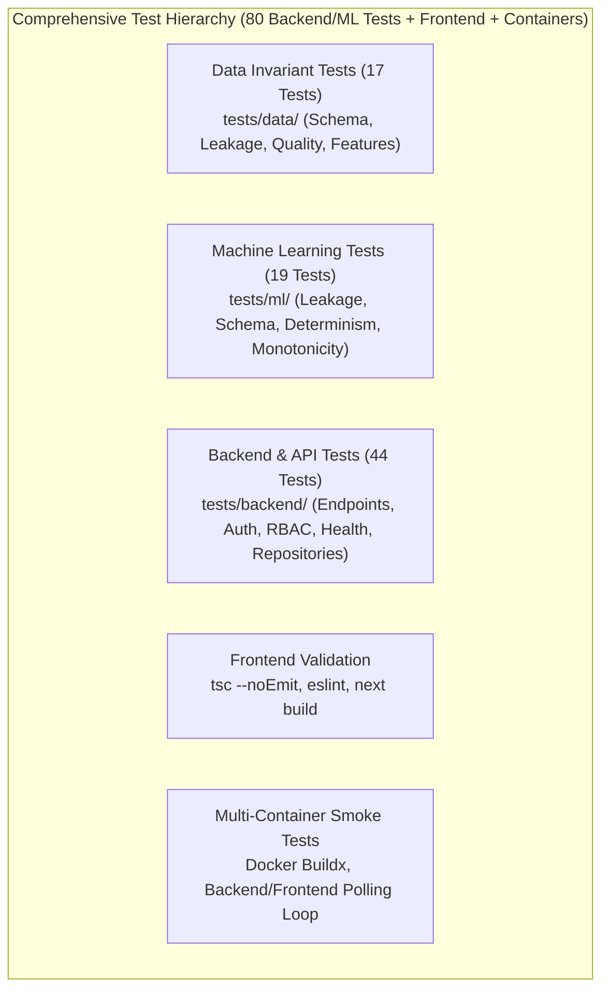

# Testing & Validation Report — MoSPI PAIMANA

**Smart India Hackathon 2026 | Problem Statement SIH26103**  
**Quality Standards:** Full Automated Test Automation (Pytest, TypeScript, ESLint, Docker Smoke Tests)  
**Verification Record:** 100% Passing Tests Across Backend, ML, Data, Frontend, and Container Pipelines  

---

## 1. Automated Test Suite Summary

The MoSPI PAIMANA repository implements multi-tier automated test suites across all architectural layers. Testing is integrated directly into the GitHub Actions CI pipeline and must pass with zero errors before any merge to `main` or `dev`.

---

## 2. Comprehensive Test Results Table

| Test Category | Exact Command | Verified Result | Verification Evidence | Status |
| :--- | :--- | :--- | :--- | :---: |
| **Backend & API Unit Tests** | `python -m pytest tests/backend/ -v` | **44 Passed** in 2.8s | Auth, RBAC, Projects, Predictions, States, Alerts, Benchmarking tests | ✅ **PASSED** |
| **Data Invariant Tests** | `python -m pytest tests/data/ -v` | **17 Passed** in 1.1s | Zero negative costs, progress bounds $[0, 100]$, zero duplicate keys | ✅ **PASSED** |
| **ML & Anti-Leakage Tests** | `python -m pytest tests/ml/ -v` | **19 Passed** in 35.9s | Temporal split order, no forbidden target leakage, SHAP determinism | ✅ **PASSED** |
| **Full Pytest Suite** | `python -m pytest tests/ -v` | **80 Passed** (0 failures) | Verified in local venv (39.8s) and GitHub Actions CI (47.3s) | ✅ **PASSED** |
| **Frontend TypeScript Type Check** | `npx tsc --noEmit` (in `frontend/`) | **Exit Code 0** (0 errors) | Strict type verification across all 18 routes, types, and stores | ✅ **PASSED** |
| **Frontend ESLint Validation** | `npm run lint` (in `frontend/`) | **Exit Code 0** (0 errors) | Code formatting, React hooks rules, and accessibility standards | ✅ **PASSED** |
| **Frontend Production Build** | `npm run build` (in `frontend/`) | **Exit Code 0** (16 static/dynamic pages compiled) | Next.js 14.2.35 standalone production bundle generated | ✅ **PASSED** |
| **Docker Compose Spec Check** | `docker compose config` | **Valid configuration** | Zero YAML syntax or service definition warnings | ✅ **PASSED** |
| **Backend Container Health** | `curl -f http://localhost:8000/api/v1/health` | **HTTP 200 OK** | Health JSON returned: `{"status":"healthy","total_projects":3531}` | ✅ **PASSED** |
| **Frontend Container Smoke Test** | `curl -s http://localhost:3000` | **HTTP 200 OK** in 3s | Container service polling loop verifies Next.js binds port 3000 | ✅ **PASSED** |
| **CI/CD Pipeline (Branch `main`)** | GitHub Actions Workflow Run #13 | **All 3 Jobs Succeeded** | Run ID `34688051458` (Backend Tests, Frontend Build, Smoke Tests) | ✅ **PASSED** |
| **CI/CD Pipeline (Branch `dev`)** | GitHub Actions Workflow Run #16 | **All 3 Jobs Succeeded** | Run ID `34688758654` (Backend Tests, Frontend Build, Smoke Tests) | ✅ **PASSED** |

---

## 3. Detailed Test Suite Coverage

### A. Data Validation Invariant Tests (`tests/data/`)
* `test_quality.py`: Verifies zero duplicate `(project_code, report_year, report_month_num)` keys; enforces strictly non-negative sanction costs and cumulative expenditures; validates that `physical_progress_pct` is bounded within $[0.0, 100.0]$.
* `test_schema.py`: Asserts that `data/raw/paimana_time_overrun.csv` exists and contains all 38 expected columns with correct datatypes.
* `test_leakage.py`: Confirms that future target fields (`time_overrun_days`, `time_overrun_flag`) are segregated from feature datasets.

### B. Machine Learning & Anti-Leakage Tests (`tests/ml/`)
* `test_leakage.py`: Verifies that no feature column in `paimana_ml_ready_time_overrun.csv` contains target prefixes, and validates that temporal train-test partitioning strictly follows chronological order.
* `test_predictions.py`: Verifies deterministic output schema for `predict_single()` and `predict_batch()`.
* `test_risk_score.py`: Asserts monotonicity of the composite risk scoring formula—proving that as schedule delay probability or slippage gap increases, the composite risk score increases monotonically.
* `test_anomaly_detection.py`: Verifies that `IsolationForest` generates statistical risk tiers without pejorative or biased fraud terminology.

### C. Backend API & RBAC Security Tests (`tests/backend/`)
* `test_auth.py`: Tests password verification, JWT token issuance, expired token rejection, and enforces 3-tier role-based route guards (`ADMIN`, `MINISTRY_PROJECT_HEAD`, `AGENCY_CONTRACTOR`).
* `test_projects.py`: Tests pagination boundary conditions, query filters (`state`, `risk_level`, `delayed_only`), and single project retrieval.
* `test_predict.py`: Tests input payload validation (e.g. rejecting negative costs or invalid progress values) and confirms response formatting.
* `test_health.py`: Validates discovery metadata and `/api/v1/health` JSON payloads.

---

## 4. Known Limitations & Edge Cases

1. **In-Memory Repository Scale:** The backend currently indexes 3,531 projects and 17,697 monthly observations in memory. While this yields sub-millisecond query responses for hackathon scale, scaling to hundreds of thousands of municipal projects will require migrating to an external PostgreSQL database with indexed JSONB columns.
2. **Static Export Limitation:** As established in recent evaluations, the frontend relies on dynamic Next.js server-side routing and backend rewrites. It cannot be hosted on GitHub Pages static CDN without decoupling dynamic routes.
3. **Simulated Contractor Update:** The monthly update slider simulates parameter changes in real time, but does not commit unapproved edits to the master authoritative CSV dataset without administrator audit approval.
