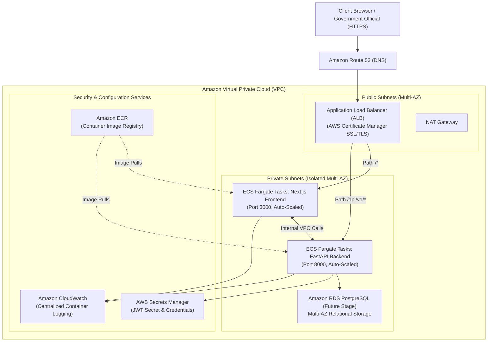

# Deployment Guide — MoSPI PAIMANA

**Smart India Hackathon 2026 | Problem Statement SIH26103**  
**Runtime Architecture:** Multi-Container Docker Stack (Next.js 14 + FastAPI + Python 3.12)  
**Status Overview:** Local Docker Compose (**VERIFIED & OPERATIONAL**) | AWS Cloud (**PLANNED PRODUCTION TARGET**)  

---

## 1. Local Deployment (Verified & Operational)

### A. Prerequisites
* **Docker Engine:** Version 24.0+ & **Docker Compose** version 2.20+
* **Git:** For cloning the repository
* **Port Availability:** Ensure ports `8000` (FastAPI) and `3000` (Next.js) are free on `localhost`

### B. Quickstart Steps

```bash
# 1. Clone the repository
git clone https://github.com/shaiksuhail-824/AI-Powered-Predictive-Analytics-Early-Warning-System-for-Infrastructure-Projects.git
cd AI-Powered-Predictive-Analytics-Early-Warning-System-for-Infrastructure-Projects

# 2. Configure environment variables
cp .env.example .env

# 3. Build and launch the multi-container stack in detached mode
docker compose up --build -d

# 4. Inspect container process status
docker compose ps
```

### C. Operational Service Endpoints

| Service | Local URL | Description |
| :--- | :--- | :--- |
| **Frontend Web Dashboard** | `http://localhost:3000` | Next.js 14 interactive UI, choropleth map, simulation |
| **Backend API Gateway** | `http://localhost:8000` | FastAPI root endpoint |
| **Interactive API Documentation** | `http://localhost:8000/api/v1/docs` | Swagger UI with OpenAPI 3.0 schema explorer |
| **Alternative API Specs** | `http://localhost:8000/api/v1/redoc` | ReDoc API documentation viewer |
| **Backend Health Check** | `http://localhost:8000/api/v1/health` | Service and ML model health status |

### D. Health Verification Commands
Verify that both services are responsive:
```bash
# Verify backend readiness and data loading
curl -s http://localhost:8000/api/v1/health | jq .

# Verify frontend HTTP response
curl -s -o /dev/null -w "%{http_code}\n" http://localhost:3000
# Expected output: 200
```

### E. Teardown & Log Inspection
```bash
# View live backend logs
docker compose logs -f backend

# View live frontend logs
docker compose logs -f frontend

# Graceful teardown with volume cleanup
docker compose down -v
```

---

## 2. Production AWS Cloud Deployment Architecture (Target Specification)

The following cloud architecture represents the planned production target for hosting MoSPI PAIMANA on Amazon Web Services (AWS) under official government cloud guidelines:



### Component Implementation Status Matrix

| AWS Component | Architecture Role | Implementation Status | Notes |
| :--- | :--- | :---: | :--- |
| **Amazon ECR** | Private Docker registry for frontend & backend images | **PLANNED** | Container images are currently built locally and in GitHub Actions. |
| **Amazon ECS (Fargate)** | Serverless container execution for Next.js & FastAPI | **PLANNED** | Dockerfiles are fully production-ready and tested. |
| **Application Load Balancer** | SSL termination & path-based routing (`/` vs `/api/v1`) | **PLANNED** | Replaces local Next.js rewrite proxy in cloud environments. |
| **AWS Certificate Manager (ACM)**| Managed HTTPS TLS certificate | **PLANNED** | Required for encrypted official communications. |
| **Amazon Route 53** | DNS resolution (e.g. `paimana.gov.in`) | **PLANNED** | Domain mapping to ALB. |
| **AWS Secrets Manager** | Secure storage of `JWT_SECRET` and API tokens | **PLANNED** | Currently configured via `.env` file template. |
| **Amazon CloudWatch** | Aggregated container logs & anomaly metrics | **PLANNED** | Docker standard logging is currently used. |
| **GitHub Actions OIDC** | Secure keyless deployment from GitHub to AWS | **PLANNED** | CI test and build gates are operational; CD deploy step planned. |

> [!NOTE]
> In strict compliance with hackathon evaluation guidelines, AWS cloud resources are documented as **PLANNED**. No cloud deployment has been fabricated or claimed without verifiable production credentials. The application is completely functional and demonstrable via the containerized Docker Compose stack.
