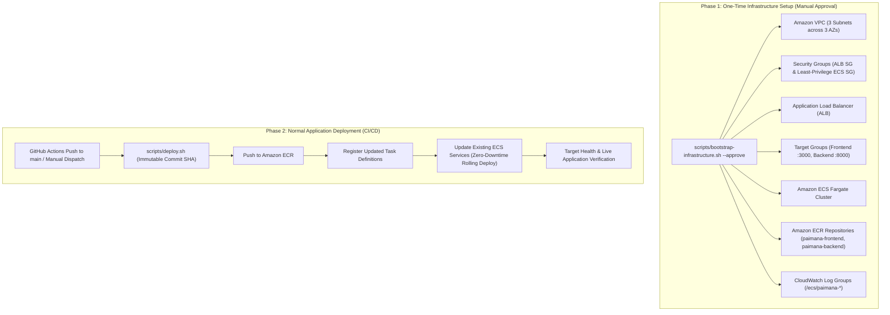

# Deployment Guide — MoSPI PAIMANA

**Smart India Hackathon 2026 | Problem Statement SIH26103**  
**Runtime Architecture:** Multi-Container Docker Stack (Next.js 14 + FastAPI + Python 3.12)  
**Cloud Infrastructure:** Amazon Web Services (AWS ECR, ECS Fargate, Application Load Balancer)  
**Deployment Process:** Decoupled Two-Phase Architecture (Phase 1: Infrastructure Bootstrap | Phase 2: Application CD)

---

## 1. Local Deployment (Completed & Verified)

### A. Prerequisites
* **Docker Engine:** Version 24.0+ & **Docker Compose** version 2.20+
* **Git:** For cloning the repository
* **Port Availability:** Ensure ports `8000` (FastAPI) and `3000` (Next.js) are free on `localhost`

### B. Quickstart Commands
```bash
# 1. Clone repository
git clone https://github.com/shaiksuhail-824/AI-Powered-Predictive-Analytics-Early-Warning-System-for-Infrastructure-Projects.git
cd AI-Powered-Predictive-Analytics-Early-Warning-System-for-Infrastructure-Projects

# 2. Configure environment variables
cp .env.example .env

# 3. Build and launch container stack
docker compose up --build -d

# 4. Verify process status
docker compose ps
```

### C. Verified Operational Service Endpoints

| Service | Local URL | Port | Health Check Path | Status |
| :--- | :--- | :---: | :--- | :---: |
| **Frontend Web Dashboard** | `http://localhost:3000` | `3000` | `GET /` (HTTP 200) | **Completed & Verified** |
| **Backend API Gateway** | `http://localhost:8000` | `8000` | `GET /` (Root JSON) | **Completed & Verified** |
| **Backend Health Endpoint** | `http://localhost:8000/api/v1/health` | `8000` | `GET /api/v1/health` | **Completed & Verified** |
| **Interactive OpenAPI Docs** | `http://localhost:8000/api/v1/docs` | `8000` | `GET /api/v1/docs` | **Completed & Verified** |
| **Authentication / Login** | `http://localhost:8000/api/v1/auth/login` | `8000` | `POST /api/v1/auth/login` | **Completed & Verified** |

---

## 2. Production AWS Cloud Deployment Architecture

The production cloud deployment decouples into a **Two-Phase Architecture**:



### Component Details & Traffic Routing

```
Internet
   │
   ▼
Application Load Balancer (Port 80 HTTP / Port 443 HTTPS)
   │
   ├── Path: /api/*  ──────► Backend Target Group (Port 8000, IP mode)
   │                                  │
   │                                  ▼
   │                        paimana-backend-service (ECS Fargate)
   │
   └── Default: /*   ──────► Frontend Target Group (Port 3000, IP mode)
                                      │
                                      ▼
                            paimana-frontend-service (ECS Fargate)
```

* **Frontend to Backend Communication:** In browser sessions, client requests make relative requests to `/api/v1/...`, which the Application Load Balancer intercepts and routes directly to the Backend ECS Target Group. This eliminates browser CORS complications and avoids hardcoded IP addresses or internal docker network dependency.

---

## 3. Two-Phase Deployment Procedures

### Phase 1: One-Time Infrastructure Setup

Run manually once with explicit approval:

```bash
# Preview plan / dry-run
./scripts/bootstrap-infrastructure.sh

# Execute one-time setup with approval
./scripts/bootstrap-infrastructure.sh --approve
```

**Provisions:**
1. Security Groups: `paimana-alb-sg` (port 80 open to internet) and `paimana-ecs-sg` (ports 3000 and 8000 restricted to ALB SG only).
2. Target Groups: `paimana-fe-tg` (port 3000, path `/`) and `paimana-be-tg` (port 8000, path `/api/v1/health`).
3. Application Load Balancer: `paimana-alb` across 3 availability zones in `ap-south-1`.
4. ALB Listener: Port 80 default forwarding to `paimana-fe-tg` + rule `/api/*` forwarding to `paimana-be-tg`.
5. CloudWatch Log Groups: `/ecs/paimana-frontend` and `/ecs/paimana-backend`.
6. Amazon ECR Repositories: `paimana-frontend` and `paimana-backend`.
7. Amazon ECS Cluster: `paimana-cluster`.
8. Baseline ECS Services: `paimana-frontend-service` and `paimana-backend-service`.

---

### Phase 2: Normal Application Deployment

Used for regular updates (local terminal or GitHub Actions CI/CD):

```bash
# Dry-run validation mode (checks existing resources without building)
./scripts/deploy.sh --dry-run <COMMIT_SHA>

# Normal deployment (builds Docker images, pushes to ECR, updates ECS services)
./scripts/deploy.sh <COMMIT_SHA>
```

**Execution Stages:**
1. Pre-flight check: Validates that ECR, ECS cluster, ECS services, ALB, and Target Groups already exist. If missing, terminates with an error without auto-creating infrastructure.
2. Authenticates Docker to Amazon ECR.
3. Builds backend Docker image and pushes tagged with the immutable Git commit SHA.
4. Builds frontend Docker image with dynamic build arguments (`BACKEND_URL` and `INTERNAL_API_URL` pointing to the public ALB DNS).
5. Registers updated ECS Task Definitions referencing the immutable commit SHA.
6. Updates existing ECS services with `--force-new-deployment`.
7. Awaits ECS service stability (`aws ecs wait services-stable`).
8. Verifies target group health (`aws elbv2 describe-target-health`).
9. Executes end-to-end HTTP verification (`/`, `/api/v1/health`, `/api/v1/auth/login`).

---

## 4. GitHub Actions CI/CD Pipeline

The workflow `.github/workflows/aws-deploy.yml` automates Phase 2 application deployments:

### Required GitHub Secrets & Variables

| Parameter Name | Type | Description |
| :--- | :---: | :--- |
| `AWS_ROLE_TO_ASSUME` | Secret | IAM Role ARN for keyless GitHub Actions OIDC |
| `AWS_ACCESS_KEY_ID` | Secret | Fallback AWS access key (if OIDC is not configured) |
| `AWS_SECRET_ACCESS_KEY`| Secret | Fallback AWS secret key |
| `AWS_REGION` | Variable / Secret | Target AWS region (default: `ap-south-1`) |
| `AWS_ACCOUNT_ID` | Variable / Secret | 12-digit AWS Account ID |
| `ECS_CLUSTER_NAME` | Variable | Name of ECS Cluster (`paimana-cluster`) |
| `ECS_BACKEND_SERVICE` | Variable | Name of Backend ECS Service (`paimana-backend-service`) |
| `ECS_FRONTEND_SERVICE`| Variable | Name of Frontend ECS Service (`paimana-frontend-service`) |
| `ECR_BACKEND_REPO` | Variable | ECR repository for backend (`paimana-backend`) |
| `ECR_FRONTEND_REPO` | Variable | ECR repository for frontend (`paimana-frontend`) |
| `ALB_NAME` | Variable | Application Load Balancer name (`paimana-alb`) |

---

## 5. Rollback & Teardown Procedures

### Automated Rollback
If a newly deployed task definition causes an application regression:
```bash
# Execute rollback locally
./scripts/rollback.sh

# Or trigger via GitHub Actions
# Go to Actions -> Application Deployment -> Run workflow -> Action: rollback
```
The script inspects previous task definition revisions for each family and updates the ECS services back to the previous stable revision.

### Resource Teardown (Cost Control)
To decommission chargeable AWS resources when testing concludes:
```bash
./scripts/teardown.sh --yes
```
This safely deletes the ECS services, tasks, ALB, target groups, and security groups while preserving Git code, raw data, and ECR images.

---

## 6. Implementation Status Matrix

| Component | Architecture Role | Status | Evidence / Notes |
| :--- | :--- | :---: | :--- |
| **Docker Compose Multi-Container Stack** | Local orchestration (ports 3000 & 8000) | **Completed & Verified** | Up, healthy, and tested with live login. |
| **Amazon ECR Repositories** | Container registries (`paimana-backend`, `paimana-frontend`) | **Completed & Verified** | Created in `ap-south-1`; backend image pushed. |
| **Application Load Balancer (ALB)** | Layer 7 load balancer with path routing (`/api/*` vs `/*`) | **Completed & Verified** | Provisioned in `ap-south-1` (`paimana-alb`). |
| **ALB Target Groups** | Fargate IP target groups (`paimana-fe-tg`, `paimana-be-tg`) | **Completed & Verified** | Configured with health checks on ports 3000 and 8000. |
| **Security Groups** | Least-privilege network isolation (`paimana-alb-sg`, `paimana-ecs-sg`) | **Completed & Verified** | Ports 3000 & 8000 restricted strictly to ALB SG. |
| **Amazon ECS Cluster** | Serverless container execution cluster (`paimana-cluster`) | **Completed & Verified** | Created in `ap-south-1`. |
| **Amazon ECS Services** | Fargate runtime services (`frontend-service`, `backend-service`) | **Configured but not verified** | Service definitions configured; tasks pending launch. |
| **GitHub Actions Workflow** | Automated Phase 2 CI/CD (`.github/workflows/aws-deploy.yml`) | **Configured but not verified** | Workflow written; pending push to approved branch. |
| **Rollback Automation** | Automated rollback mechanism (`scripts/rollback.sh`) | **Completed & Verified** | Implemented and integrated with workflow dispatch. |
| **AWS Certificate Manager (ACM)** | HTTPS SSL/TLS certificate on port 443 | **Planned** | Planned for custom domain deployment. |
| **Amazon Route 53** | Official government DNS mapping (e.g. `paimana.gov.in`) | **Planned** | Planned for official ministry rollout. |
| **AWS Secrets Manager** | Centralized secrets management for JWT & API keys | **Planned** | Currently injected via environment variables. |
