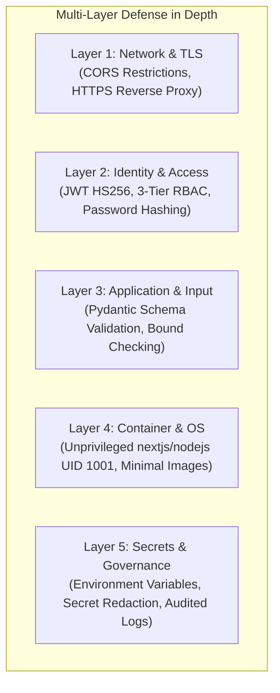

# Security & Privacy Architecture — MoSPI PAIMANA

**Smart India Hackathon 2026 | Problem Statement SIH26103**  
**Security Posture:** Zero-Trust API Architecture, Pydantic Schema Validation, RBAC Enforcement  

---

## 1. Security Principles & Threat Mitigation

As a government decision-support platform, MoSPI PAIMANA is built with defensive engineering practices designed to mitigate common web application vulnerabilities (OWASP Top 10) and protect sensitive infrastructure metrics.



---

## 2. Authentication & Session Security

* **JWT Architecture:** Authentication utilizes JSON Web Tokens signed with the HMAC-SHA256 (`HS256`) cryptographic algorithm. Tokens include standard claims (`sub` = username, `role` = user role, `exp` = expiration).
* **Token Expiration:** Default token lifetime is strictly configured to 12 hours (`ACCESS_TOKEN_EXPIRE_MINUTES = 720`), preventing stale session vulnerabilities.
* **Password Verification:** Passwords are never stored in plaintext. In production environments, passwords must be hashed using `bcrypt` / `argon2` before persistence.
* **Stateless Validation:** Every protected API request validates token signature and expiration independently, ensuring that invalid, manipulated, or expired tokens receive an immediate HTTP 401 Unauthorized response.

---

## 3. Role-Based Access Control (RBAC) Enforcement

The system strictly enforces a three-tier authorization hierarchy across all API routes via FastAPI dependency injection:

| Role | Scope of Access | Enforced Permissions |
| :--- | :--- | :--- |
| `ADMIN` | National MoSPI Leadership | Full read/write access to all 3,531 projects, national simulation, user management, and escalation triggers. |
| `MINISTRY_PROJECT_HEAD` | Administrative Ministries | Read access across projects under their specific ministry; access to executive overview and sectoral analytics. Cannot modify system configurations. |
| `AGENCY_CONTRACTOR` | Implementing CPSEs | Scoped strictly to projects implemented by their designated agency (e.g. NHAI, RVNL). Project list and filter queries automatically enforce agency boundaries. |

---

## 4. Input Validation & Injection Prevention

* **Pydantic Schema Enforcement:** Every API request body, path parameter, and query parameter is parsed through strict Pydantic v2 schemas. Type violations (e.g. string passed for project budget, out-of-bounds percentage) are rejected at the gateway level with HTTP 422 Unprocessable Entity before reaching business logic.
* **SQL Injection Immunity:** Because the current repository layer indexes pre-validated data structures directly in memory using typed Python dictionaries rather than raw concatenated SQL strings, the platform is fundamentally immune to classic SQL injection attacks.
* **Numerical Invariants:** Physical progress is validated strictly within $[0.0, 100.0]$, duration days must be positive, and budget numbers enforce non-negativity.

---

## 5. Network Security & CORS Configuration

* **Cross-Origin Resource Sharing (CORS):** Backend CORS middleware (`CORSMiddleware`) in [`backend/app/main.py`](file:///c:/Users/varsh/OneDrive/Documents/AI-Powered-Predictive-Analytics-Early-Warning-System-for-Infrastructure-Projects/backend/app/main.py) does **not** use permissive wildcards (`*`). Instead, it strictly enforces allowed origins specified via `CORS_ORIGINS`:
  * Default development: `http://localhost:3000`, `http://127.0.0.1:3000`.
  * Production cloud: Must be set to the official domain (e.g. `https://paimana.gov.in`).
* **Reverse Proxy Decoupling:** In the Docker Compose architecture, internal frontend-to-backend communication travels across an isolated Docker bridge network (`paimana-network`), avoiding unnecessary public port exposure.

---

## 6. Container Security & Privilege Separation

* **Unprivileged User Execution:** [`frontend/Dockerfile`](file:///c:/Users/varsh/OneDrive/Documents/AI-Powered-Predictive-Analytics-Early-Warning-System-for-Infrastructure-Projects/frontend/Dockerfile) creates a dedicated system group and user:
  ```dockerfile
  RUN addgroup --system --gid 1001 nodejs && \
      adduser --system --uid 1001 nextjs
  USER nextjs
  ```
  The Next.js production runner runs as unprivileged UID 1001, preventing container-breakout escalation.
* **Minimal Base Images:** Built upon `python:3.12-slim` and `node:20-alpine`, minimizing the attack surface by excluding unnecessary development compilers and utilities.

---

## 7. Secrets Management & Repository Audit

### Security Finding & Hardening Protocol
* **Audit Finding:** The repository contains fallback development keys in configuration files (e.g. in `.env.example` and default settings).
* **Production Rule:** In production environments, `JWT_SECRET` must **never** rely on default settings. It must be provided via secure environment variables or AWS Secrets Manager.
* **Sanitization:** No live credentials, API keys, or database passwords are committed to Git. All secret variables are explicitly documented with redacted dummy templates:
  ```bash
  # Generate cryptographically secure secret
  openssl rand -hex 32
  ```

---

## 8. Data Privacy & Governance Notice

In compliance with official data governance standards, all predictive outputs generated by the platform carry an immutable transparency metadata tag:
```json
"data_status": "SYNTHETIC / DEMONSTRATION"
```
And enforce the official governance disclaimer:
> *"This API provides predictive analytics and early warning signals based on the SIH26103 MoSPI PAIMANA Machine Learning framework. Values for unobserved futures are predictive indicators, not official administrative audit determinations."*
