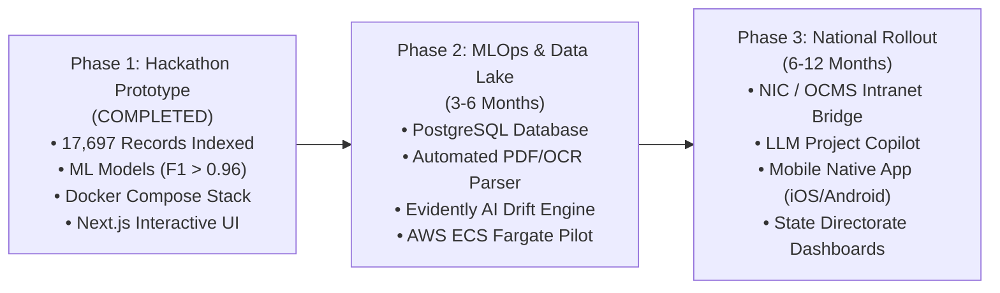

# Limitations & Future Scope — MoSPI PAIMANA

**Smart India Hackathon 2026 | Problem Statement SIH26103**  
**Assessment:** Transparent Technical Audit of Current Prototype vs. Long-Term Production Roadmap  

---

## 1. Verified Prototype Limitations

To maintain absolute credibility before the SIH evaluation panel, the known limitations of the current prototype are cataloged below:

| Dimension | Current Prototype Limitation | Technical Root Cause & Impact |
| :--- | :--- | :--- |
| **Data Ingestion** | Relies on pre-processed CSV representations | Direct OCR and computer-vision parsing of scanned, physical contractor field reports and unstructured PDFs is not yet integrated into the live pipeline. |
| **Storage Architecture** | In-memory indexing via Python repositories | Current repository indexes 3,531 projects and 17,697 monthly observations in memory. Scaling to 100,000+ local projects will require external PostgreSQL with relational indexing. |
| **Model Drift Monitoring** | Static production model evaluation | Models are trained and evaluated on fixed temporal partitions. Continuous model drift detection and automated re-training pipelines (e.g. Evidently AI / MLflow drift alerts) are not yet automated. |
| **Official System Integration**| Standalone demonstration environment | The prototype does not have a direct live API connection to the Government of India's internal NIC / OCMS networks due to statutory cybersecurity boundaries. |
| **Static Web Hosting** | Incompatible with GitHub Pages | As verified during CI evaluation, Next.js server-side dynamic routing (`[id]`, `[state]`) and FastAPI proxying require an active Node/Python server; the application cannot be hosted on static CDN-only pages. |
| **Human Validation Workflow** | Visual alert display only | Early warning alerts are presented with severity ratings and recommendations, but an end-to-end ticketing workflow with digital signature sign-offs is not yet implemented. |

---

## 2. Technical Future Scope Roadmap

The following phased roadmap outlines the path from hackathon prototype to full national deployment under MoSPI:

### Phase 2: MLOps Hardening & Enterprise Storage (Next 3–6 Months)
1. **Relational Database Migration:**
   * Migrate in-memory indexing to a managed **Amazon RDS PostgreSQL** instance utilizing TimescaleDB extensions for optimized temporal project queries.
2. **Automated PDF & DPR Document Understanding:**
   * Integrate vision-language models and OCR pipelines (e.g. Tesseract / Amazon Textract) to automatically parse unstructured Monthly Progress Reports (MPRs) and Detailed Project Reports (DPRs) submitted by CPSEs.
3. **Continuous Model Retraining & Drift Detection:**
   * Implement automated drift monitoring comparing incoming monthly feature distributions against baseline training distributions, triggering retraining alerts in MLflow when population stability index (PSI) exceeds 0.25.
4. **AWS Production Deployment:**
   * Provision AWS ECS Fargate, Application Load Balancers, Route 53, and ACM TLS certificates as detailed in the deployment guide.

### Phase 3: National Scale & Administrative Integration (6–12 Months)
1. **NIC / OCMS Government Intranet Gateway:**
   * Establish secure, read-only data connectors to MoSPI's internal Online Computerized Monitoring System (OCMS) via government API gateways.
2. **Human-in-the-Loop Remedial Action Workflows:**
   * Expand the alerts module into a formal **Remedial Action Tracking System** where designated ministry officials can acknowledge warnings, assign PMC corrective actions, and track milestone recovery.
3. **PAIMANA Multilingual LLM Copilot:**
   * Integrate fine-tuned open-source LLMs (e.g. Llama 3 / Mistral) to allow senior administrators to query project statuses via natural language in Hindi and English (e.g., *"Which railway projects in the Northeast are running behind schedule and why?"*).
4. **Mobile Native Applications:**
   * Develop native mobile applications for field engineers to capture geotagged milestone photos, physical inspection stamps, and real-time completion percentages.
